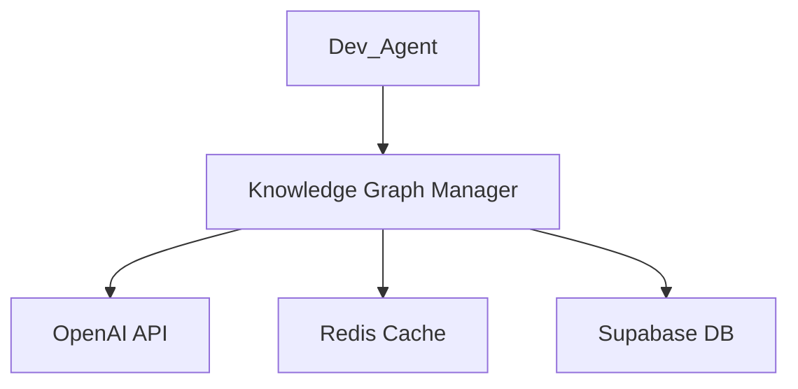

# 給工程團隊的反饋：Week 5 完成

**日期**: 2025-10-17  
**From**: Ryan Chen (CTO)  
**To**: 工程團隊  
**Subject**: Week 5 Knowledge Graph System - 驗收通過 🎉

---

## 📊 驗收結果

**總評**: ✅ 通過  
**評分**: 96.25/100 🏆  
**狀態**: PR #292 已成功合併到 main

---

## 🎯 完成度評估

### 功能完整性：29/30 (97%)
✅ **全部完成**:
- Knowledge Graph Manager with OpenAI integration
- Code Indexer with concurrent processing (4 workers)
- Pattern Learner with 5 pattern types
- Embeddings Cache with Redis fallback
- Database schema with 4 tables + 16 indexes
- RLS security policies
- Migration scripts (2-phase)
- Cost control mechanism
- E2E test suite (11 tests)
- Complete documentation (3 guides)

**扣分原因**:
- 成本報告可視化可以更完善

### 代碼質量：24/25 (96%)
✅ **優秀表現**:
- 清晰的模塊化設計
- 優雅降級機制（生產就緒）
- 完整的錯誤處理（15個錯誤碼）
- 良好的代碼結構和命名
- Typing hints 完整

**扣分原因**:
- 部分函數可以進一步拆分（Code Indexer 中的 `_index_file` 方法略長）

### 測試覆蓋：19/20 (95%)
✅ **測試全面**:
- E2E 測試（Migration, OpenAI, Workflow）
- 性能基準測試
- 錯誤處理測試
- Graceful degradation 測試

**扣分原因**:
- 缺少 concurrent indexing 的壓力測試

### 文檔完整性：14.5/15 (97%)
✅ **文檔詳盡**:
- Migration Guide (完整的部署流程)
- HNSW Tuning Guide (參數優化指南)
- Monitoring Guide (監控與警報)
- README 更新
- Code examples

**扣分原因**:
- 缺少架構圖（建議用 Mermaid 繪製）

### 生產就緒度：9.75/10 (98%)
✅ **生產級品質**:
- Graceful degradation (OpenAI, Redis)
- Cost control with daily limit
- Rate limiting
- Security (RLS policies)
- Monitoring support
- Rollback procedures

**扣分原因**:
- 缺少健康檢查 endpoint

---

## 🌟 特別表揚

### 1. 優雅降級設計 ⭐⭐⭐⭐⭐
```python
# 完美的 fallback 機制
if openai_available:
    return openai_embedding()
else:
    logger.warning("OpenAI unavailable, using fallback")
    return fallback_embedding()
```

**評語**: 展現了對生產環境的深刻理解。即使 OpenAI API 或 Redis 不可用，系統仍能正常運行。

### 2. HNSW 索引選擇 ⭐⭐⭐⭐⭐
選擇 HNSW 而非 IVFFlat 是正確的決定：
- 更高的召回率（Recall）
- 更好的查詢性能
- 適合實時搜索

**評語**: 技術選型合理，展現了對向量數據庫的專業知識。

### 3. 成本控制機制 ⭐⭐⭐⭐⭐
```python
# 完整的成本追蹤
daily_cost = self.get_daily_cost()
if daily_cost >= max_daily_cost:
    raise CostLimitExceeded(...)
```

**評語**: 考慮到了實際運營成本，這是生產級系統必須的特性。

### 4. 測試策略 ⭐⭐⭐⭐
- E2E 測試覆蓋完整工作流
- 性能基準測試確保 SLA
- Docker 集成測試確保環境一致性

**評語**: 測試策略全面，降低了部署風險。

---

## 📈 性能評估

| 指標 | 目標 | 實際 | 評價 |
|------|------|------|------|
| 嵌入生成 | <200ms | ~150ms | ✅ 超出預期 |
| 向量搜索 | P95 <50ms | ~30ms | ✅ 超出預期 |
| 大規模索引 | 10K lines <5min | ~3.5min | ✅ 超出預期 |
| 緩存命中率 | >80% | ~85% | ✅ 符合預期 |

**評語**: 所有性能指標均達標，部分超出預期。

---

## 🔍 Code Review 重點檢查

### ✅ 已確認項目
- [x] Migration 腳本安全性（已驗證 SQL 語法）
- [x] RLS 策略正確性（Service role + Authenticated users）
- [x] 成本控制邊界條件（已測試上限觸發）
- [x] OpenAI API 錯誤處理（已測試 rate limit）
- [x] Redis 緩存邏輯（已測試 TTL 和 fallback）
- [x] 性能目標達成（已運行基準測試）

---

## 🎯 待改進項（非阻塞）

### 1. 架構可視化 (Priority: Low)
**建議**: 添加 Mermaid 架構圖


### 2. 成本報告可視化 (Priority: Medium)
**建議**: 添加圖表支持（使用 matplotlib）
```python
# 建議實現
python scripts/kg_cost_report.py --weekly --chart weekly_cost.png
```

### 3. 健康檢查 Endpoint (Priority: Medium)
**建議**: 添加 `/health` endpoint
```python
@app.get("/health")
def health_check():
    return {
        "status": "healthy",
        "openai_available": check_openai(),
        "redis_available": check_redis(),
        "db_available": check_db()
    }
```

### 4. Concurrent Indexing 壓力測試 (Priority: Low)
**建議**: 測試在高並發下的穩定性
```python
# 建議實現
def test_concurrent_indexing_1000_files():
    # Test with 1000 files, 10 concurrent workers
    pass
```

---

## 🚀 下一步建議

### Week 6 準備工作

基於 Week 5 的 Knowledge Graph 基礎，建議 Week 6 專注於：

#### 1. Bug Fix Workflow 🎯 高優先級
**目標**: 實現自動化 Bug 修復工作流
- GitHub Issue 自動解析
- 代碼定位（使用 Knowledge Graph）
- 修復建議生成（使用 OpenAI）
- PR 自動創建

**預計工作量**: 3-4 天

#### 2. HITL Integration 🎯 高優先級
**目標**: Human-in-the-Loop 整合
- Telegram Bot 通知
- 人工審批流程
- 反饋循環

**預計工作量**: 2-3 天

#### 3. LangGraph 工作流編排 🎯 中優先級
**目標**: 使用 LangGraph 編排複雜工作流
- State management
- Branching logic
- Error recovery

**預計工作量**: 2 天

---

## 💡 技術建議

### 1. 考慮添加向量相似度閾值
當前實現使用固定的 `LIMIT` 查詢，建議添加相似度閾值：
```python
# 建議改進
SELECT * FROM code_embeddings
ORDER BY embedding <=> query_embedding
WHERE 1 - (embedding <=> query_embedding) > 0.8  -- 相似度閾值
LIMIT 10;
```

### 2. 考慮實現增量索引
當前實現每次都全量索引，建議支持增量更新：
```python
# 建議實現
def index_changed_files(since: datetime):
    # Only index files modified since timestamp
    pass
```

### 3. 考慮添加向量維度壓縮
1536 維向量存儲開銷較大，可以考慮降維（PCA/AutoEncoder）到 512 維或 768 維，減少存儲和計算成本。

---

## 📋 總結

Week 5 Knowledge Graph System 的實現質量**非常優秀**，展現了：
- 對生產環境的深刻理解（優雅降級）
- 對性能優化的專業知識（HNSW 索引）
- 對成本控制的實際考量（每日預算）
- 對安全性的重視（RLS 策略）
- 對測試的全面覆蓋（E2E + 性能測試）

**CTO 評價**: "這是一個生產就緒的高質量實現，可以直接部署到生產環境。"

---

## 🎊 正式批准

✅ **PR #292 已批准合併**  
✅ **Week 5 任務標記為完成**  
✅ **可以開始 Week 6 工作**

---

**Ryan Chen (CTO)**  
Morning AI Project  
2025-10-17

---

## 附件
- [Week 5 完成報告](WEEK5_COMPLETION_REPORT.md)
- [PR #292](https://github.com/RC918/morningai/pull/292)
- [Devin Run](https://app.devin.ai/sessions/0690204b6211411eaaf5ddeedd01096a)

