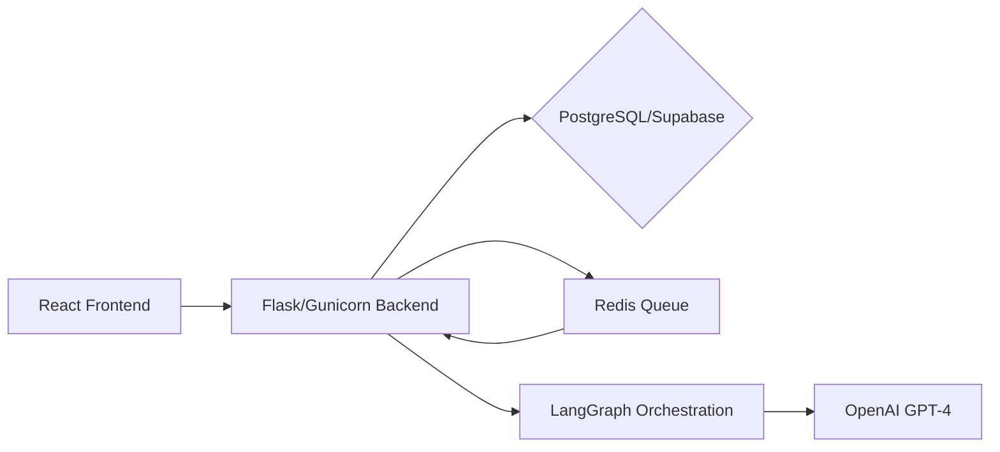

# System Architecture of MorningAI

The system architecture of MorningAI is designed to be scalable, efficient, and robust, catering to the needs of developers and businesses by providing an autonomous agent system for code generation, FAQ generation, documentation management, multi-platform integration, real-time task orchestration with Redis Queue, and vector memory storage with pgvector/Supabase.

## Overview

MorningAI's architecture is composed of several key components working in harmony to deliver its full range of services:

- **Frontend:** Utilizes React for building user interfaces along with Vite for optimizing the build process. TailwindCSS is employed for styling, offering a utility-first CSS framework for rapidly building custom designs.
  
- **Backend:** Python and Flask serve as the backbone for server-side operations, with Gunicorn acting as the WSGI HTTP Server to manage multiple worker processes. This setup ensures scalability and efficient processing of requests.
  
- **Database:** PostgreSQL is used for data storage, augmented by Supabase to add real-time capabilities and Row Level Security (RLS) for enhanced data protection.

- **Queue System:** Redis Queue (RQ) is implemented for managing background tasks, allowing asynchronous task processing which is crucial for real-time task orchestration.

- **Orchestration:** LangGraph is used for orchestrating agent workflows, enabling complex autonomous agent interactions within the system.

- **AI Integration:** OpenAI's GPT-4 provides advanced AI capabilities for content generation, including code snippets and documentation.

- **Deployment:** The platform is deployed on Render.com with continuous integration and continuous deployment (CI/CD), ensuring updates are smoothly rolled out without downtime.

## Detailed Component Interaction

1. **User Interactions**: Initiated through the React-based frontend where users can request services such as code generation or documentation management.
2. **Backend Processing**: Requests are sent to the Flask/Gunicorn backend which handles logic and interacts with other components.
3. **Data Management**: Data persistence and retrieval are managed through PostgreSQL/Supabase, ensuring secure and scalable storage solutions.
4. **Task Queuing**: Asynchronous tasks like long-running operations are managed through Redis Queue, facilitating non-blocking task execution.
5. **Workflow Orchestration**: Complex workflows are orchestrated using LangGraph, integrating various components and AI functionalities seamlessly.
6. **AI Content Generation**: GPT-4 from OpenAI is utilized for generating high-quality content based on user requests or automated tasks.

## Related Documentation Links

For more in-depth information on each component:
- React: [React Official Documentation](https://reactjs.org/docs/getting-started.html)
- Flask: [Flask Documentation](https://flask.palletsprojects.com/en/2.0.x/)
- Gunicorn: [Gunicorn Documentation](https://docs.gunicorn.org/en/stable/)
- PostgreSQL/Supabase: [Supabase Documentation](https://supabase.io/docs)
- Redis Queue (RQ): [RQ Documentation](https://python-rq.org/docs/)
- LangGraph: [LangGraph GitHub Repository](https://github.com/langgraph/langgraph)
- OpenAI GPT-4: [OpenAI API Documentation](https://openai.com/api/)
- Deployment on Render.com: [Render Documentation](https://render.com/docs)

## Common Troubleshooting Tips

### Backend Service Unresponsive

If the Flask/Gunicorn backend becomes unresponsive:
1. Check Gunicorn logs for any errors.
2. Verify that all worker processes are running correctly.
3. Ensure there's adequate system resources (CPU/RAM).

### Database Connection Issues

For problems connecting to PostgreSQL/Supabase:
1. Validate database credentials in your configuration files.
2. Check network ACLs/firewall settings allowing access from your application host.
3. Ensure that RLS policies do not inadvertently block access to required data.

### Task Queue Delays

If experiencing delays in task processing with Redis Queue:
1. Inspect the size of the queue to ensure it's not being overwhelmed.
2. Check the number of active workers and scale accordingly.
3. Monitor Redis server metrics for any performance bottlenecks.

By understanding these components and how they interact within MorningAI's ecosystem, developers can better leverage its capabilities and troubleshoot common issues effectively.

---
Generated by MorningAI Orchestrator using GPT-4

---

**Metadata**:
- Task: What is the system architecture?
- Trace ID: `08125cef-e6c3-4962-af75-8818394fdb01`
- Generated by: MorningAI Orchestrator using gpt-4-turbo-preview
- Repository: RC918/morningai
