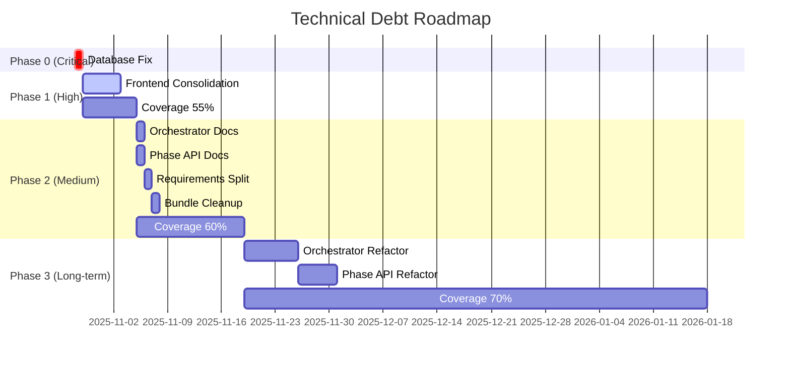

# Technical Debt & Architecture Improvements Roadmap

**Created**: 2025-10-28  
**Status**: Active  
**Owner**: CTO  
**Related PR**: #859 (CTO Week 1 Deliverables)

---

## Executive Summary

This roadmap addresses 5 critical architecture issues and 3 technical debt items identified during PR #859 review. The implementation is organized into 4 phases over 3 months, with clear priorities, dependencies, and success criteria.

**Total Estimated Effort**: 15-20 days  
**Timeline**: Week 44 2025 - Week 8 2026  
**Risk Level**: MEDIUM (with proper sequencing)

---

## Table of Contents

1. [Issues Overview](#issues-overview)
2. [Implementation Phases](#implementation-phases)
3. [Phase 0: Critical Fixes (Week 44)](#phase-0-critical-fixes-week-44)
4. [Phase 1: High Priority (Weeks 45-46)](#phase-1-high-priority-weeks-45-46)
5. [Phase 2: Medium Priority (Weeks 47-52)](#phase-2-medium-priority-weeks-47-52)
6. [Phase 3: Continuous Improvement (Q1 2026)](#phase-3-continuous-improvement-q1-2026)
7. [Dependencies & Risks](#dependencies--risks)
8. [Success Metrics](#success-metrics)

---

## Issues Overview

### Critical Issues (CRITICAL)
| ID | Issue | Impact | Effort | Priority |
|----|-------|--------|--------|----------|
| #1 | Database choice: render.yaml defaults to SQLite | Data loss risk in production | 30 min | P0 |

### High Priority Issues (HIGH)
| ID | Issue | Impact | Effort | Priority |
|----|-------|--------|--------|----------|
| #2 | Frontend duplication: 2 frontend directories | Maintenance confusion, version drift | 2-3 days | P1 |

### Medium Priority Issues (MEDIUM)
| ID | Issue | Impact | Effort | Priority |
|----|-------|--------|--------|----------|
| #3 | Orchestrator duplication: unclear roles | Developer confusion | 1 hour (short-term)<br>1 week (long-term) | P2 |
| #4 | Phase API location: unclear structure | Code organization | 1 hour (short-term)<br>2-3 days (long-term) | P2 |
| #5 | 99_Original_Bundle: 12,575 files, 129MB | CI slowness, repo bloat | 2-3 hours | P2 |

### Low Priority Issues (LOW)
| ID | Issue | Impact | Effort | Priority |
|----|-------|--------|--------|----------|
| #6 | pnpm version inconsistency | Minor version drift | 10 min | P3 |

### Technical Debt Items
| ID | Item | Impact | Effort | Priority |
|----|------|--------|--------|----------|
| #7 | FastAPI/Flask confusion in requirements | Dependency bloat | 1-2 hours | P2 |
| #8 | Test coverage too low (41% → 70%) | Quality risk | Ongoing | P1 |

---

## Implementation Phases



---

## Phase 0: Critical Fixes (Week 44)

**Timeline**: 2025-10-28 (Immediate)  
**Goal**: Prevent production data loss

### Issue #1: Database Configuration Fix 🔴 CRITICAL

**Problem**: render.yaml hardcodes `DATABASE_URL: sqlite:///database/app.db`, which overrides Render secrets and causes production to use SQLite instead of PostgreSQL.

**Impact**: 
- ❌ Data loss risk (SQLite is ephemeral on Render)
- ❌ Multi-tenant data not persisted
- ❌ Session state lost on restart

**Solution**:
```yaml
# render.yaml (line 18-19)
# BEFORE:
- key: DATABASE_URL
  value: sqlite:///database/app.db

# AFTER:
- key: DATABASE_URL
  sync: false  # Use Render secret
```

**Additional Changes**:
1. Add startup validation in `main.py`:
```python
if ENVIRONMENT == 'production' and DATABASE_URL.startswith('sqlite'):
    raise RuntimeError("Production must use PostgreSQL, not SQLite")
```

2. Improve logging (replace `print()` with proper logging):
```python
# BEFORE:
print(f"Using database: {DATABASE_URL}")

# AFTER:
app.logger.info(f"Database: {db_driver} (host: {db_host})")
```

3. Verify Render secrets are set:
   - `morningai-backend-v2`: Production Supabase DATABASE_URL
   - `morningai-backend-v2-stg`: Staging Supabase DATABASE_URL

**Acceptance Criteria**:
- [ ] render.yaml updated (DATABASE_URL sync: false)
- [ ] Startup validation added
- [ ] Logging improved (no print statements)
- [ ] Render secrets verified
- [ ] Deployed and tested on staging
- [ ] Health check confirms PostgreSQL connection

**Effort**: 30 minutes  
**Risk**: LOW (simple config change)  
**Owner**: Backend Team  
**GitHub Issue**: #860

---

## Phase 1: High Priority (Weeks 45-46)

**Timeline**: 2025-10-29 to 2025-11-08 (2 weeks)  
**Goal**: Eliminate major confusion and improve quality

### Issue #2: Frontend Consolidation 🔴 HIGH

**Problem**: Two frontend directories with different purposes but unclear separation:
- ~~`frontend-dashboard-deploy/`: Storybook/LHCI (pnpm@10.4.1)~~ **CONSOLIDATED** ✅
- `handoff/20250928/40_App/frontend-dashboard/`: Production (pnpm@9.15.1)

**Impact**:
- ❌ Developers confused about which to modify
- ❌ Version drift (pnpm 9.15.1 vs 10.4.1)
- ❌ Duplicate dependencies and maintenance
- ❌ 20+ files reference the wrong directory

**Solution**: Consolidate to single source of truth

**Step 1: Migrate LHCI/Storybook** (Day 1-2)
```bash
# Move LHCI config
cp frontend-dashboard-deploy/lhci-puppeteer-auth.js \
   handoff/20250928/40_App/frontend-dashboard/  # ✅ DONE

# Update lighthouserc.json
sed -i 's|frontend-dashboard-deploy|handoff/20250928/40_App/frontend-dashboard|g' \
   lighthouserc.json
```

**Step 2: Update References** (Day 2-3)
Files to update (20+ files):
- `lighthouserc.json`
- `lighthouserc.main.json`
- `scripts/make-lhci-cookie.js`
- `scripts/make-lhci-pr-comment.js`
- `scripts/update-baseline-and-trend.js`
- `scripts/compare_package_json.js`
- `pnpm-workspace.yaml`
- `docs/LIGHTHOUSE_CI_GUIDE.md`
- `.github/workflows/` (any LHCI workflows)

**Step 3: Verify CI** (Day 3)
- [ ] LHCI runs against production frontend
- [ ] Storybook builds successfully
- [ ] All tests pass

**Step 4: Remove Old Directory** (Day 4)
```bash
# Option A: Delete
git rm -rf frontend-dashboard-deploy/  # Pending - Phase 6

# Option B: Archive (safer)
git mv frontend-dashboard-deploy/ tools/frontend-lab/  # Alternative approach - Phase 6
echo "# DEPRECATED: Use handoff/20250928/40_App/frontend-dashboard" > tools/frontend-lab/README.md
```

**Step 5: Standardize pnpm** (Day 4)
```json
// All package.json files
"packageManager": "pnpm@9.15.1"

// Add engines
"engines": {
  "node": ">=20.0.0",
  "pnpm": ">=9.0.0"
}
```

**Acceptance Criteria**:
- [ ] LHCI/Storybook migrated to production frontend
- [ ] All 20+ references updated
- [ ] CI workflows updated and passing
- [ ] Old directory removed or archived
- [ ] pnpm version standardized to 9.15.1
- [ ] Documentation updated

**Effort**: 2-3 days  
**Risk**: MEDIUM (many file changes)  
**Owner**: Frontend Team  
**GitHub Issue**: #861

---

### Issue #8: Test Coverage Improvement (41% → 55%) 🔴 HIGH

**Problem**: Current coverage 41% is too low, target should be 70%+

**Phase 1 Goal**: Raise to 55% (achievable in 2 weeks)

**Strategy**:
1. **Add "no-new-uncovered-files" rule** (Day 1)
```yaml
# .github/workflows/backend.yml
- name: Check coverage
  run: |
    pytest --cov=src --cov-report=term --cov-fail-under=55
    # Fail if new files have <80% coverage
    coverage json
    python scripts/check_new_file_coverage.py
```

2. **Target high-impact modules** (Days 2-10)
Priority modules (based on usage frequency):
- `src/main.py` (health checks, startup) - Current: 65% → Target: 85%
- `src/database.py` (connection, sessions) - Current: 45% → Target: 80%
- `src/routes/governance.py` (JWT auth) - Current: 30% → Target: 75%
- `orchestrator/task_queue/redis_queue.py` - Current: 40% → Target: 75%

3. **Add integration tests** (Days 8-10)
- Database connection with PostgreSQL
- Redis queue operations
- JWT token validation
- Health check endpoints

**Acceptance Criteria**:
- [ ] CI enforces 55% minimum coverage
- [ ] No new files with <80% coverage
- [ ] 4 priority modules reach targets
- [ ] 10+ new integration tests added
- [ ] Coverage report shows 55%+

**Effort**: 1 week  
**Risk**: LOW  
**Owner**: QA Team  
**GitHub Issue**: #862

---

## Phase 2: Medium Priority (Weeks 47-52)

**Timeline**: 2025-11-05 to 2025-11-19 (2 weeks)  
**Goal**: Improve code organization and documentation

### Issue #3: Orchestrator Role Clarification ⚠️ MEDIUM

**Problem**: Two orchestrator directories with unclear roles:
- `orchestrator/`: FastAPI API service
- `handoff/20250928/40_App/orchestrator/`: RQ Worker

**Short-term Solution** (1 hour):

**Step 1: Add README files**
```markdown
# orchestrator/README.md
# Orchestrator API Service

**Type**: FastAPI Web Service  
**Purpose**: Task submission endpoint  
**Deployment**: Render (morningai-orchestrator-api)  
**Port**: 8000  
**Health Check**: /health

## Architecture
This is the **API layer** of the orchestrator system. It receives task 
submissions via HTTP and enqueues them to Redis for worker processing.

See ADR-002 for architecture decisions.

## Related
- Worker: `handoff/20250928/40_App/orchestrator/`
- Deployment: `render.yaml` (line 108-146)
```

```markdown
# handoff/20250928/40_App/orchestrator/README.md
# Orchestrator Worker Engine

**Type**: RQ Worker (Redis Queue)  
**Purpose**: Task execution engine  
**Deployment**: Render (morningai-agent-worker)  
**Queue**: orchestrator

## Architecture
This is the **worker layer** of the orchestrator system. It polls Redis 
for tasks and executes them using the graph-based orchestration engine.

See ADR-002 for architecture decisions.

## Related
- API: `orchestrator/` (root)
- Deployment: `render.yaml` (line 51-89)
```

**Step 2: Update render.yaml descriptions**
```yaml
# Line 108
- type: web
  name: morningai-orchestrator-api
  # ADD:
  # Orchestrator API (FastAPI) - Task submission endpoint
  
# Line 51
- type: worker
  name: morningai-agent-worker
  # ADD:
  # Orchestrator Worker (RQ) - Task execution engine
```

**Step 3: Update ADR-002**
Add section clarifying the producer-consumer architecture.

**Acceptance Criteria**:
- [ ] README files added to both directories
- [ ] render.yaml descriptions updated
- [ ] ADR-002 updated with architecture diagram
- [ ] Documentation references updated

**Effort**: 1 hour  
**Risk**: LOW  
**Owner**: DevOps Team  
**GitHub Issue**: #863

---

### Issue #4: Phase API Documentation ⚠️ MEDIUM

**Problem**: Phase API files in root directory with unclear purpose:
- `phase4_meta_agent_api.py`
- `phase5_data_intelligence_api.py`
- `phase6_security_governance_api.py`
- `phase7_startup.py`

**Analysis**: These are imported by `main.py` and tests, so they're production code.

**Short-term Solution** (1 hour):

**Step 1: Add header comments**
```python
# phase4_meta_agent_api.py
"""
Phase 4: Meta-Agent Coordination API

This module provides the meta-agent coordination endpoints for the backend API.
It is imported by handoff/20250928/40_App/api-backend/src/main.py.

Status: PRODUCTION
Location: Root directory (imported by backend)
Related: ADR-001 (Backend of Record)

TODO: Move to handoff/.../api-backend/src/phases/ in future refactor
"""
```

**Step 2: Update PROJECT_STRUCTURE_REPORT.md**
Add section explaining phase API files:
```markdown
### Phase API Modules (Root Directory)

The following files are production backend modules:
- `phase4_meta_agent_api.py`: Meta-agent coordination
- `phase5_data_intelligence_api.py`: Data intelligence
- `phase6_security_governance_api.py`: Security & governance
- `phase7_startup.py`: Phase 7 initialization

**Why in root?** Historical reasons. These are imported by the backend
at `handoff/20250928/40_App/api-backend/src/main.py`.

**Future plan**: Move to `src/phases/` directory (see Issue #864).
```

**Step 3: Update ARCHITECTURE.md**
Add diagram showing import relationships.

**Acceptance Criteria**:
- [ ] Header comments added to all phase*.py files
- [ ] PROJECT_STRUCTURE_REPORT.md updated
- [ ] ARCHITECTURE.md updated with diagram
- [ ] ONBOARDING_GUIDE.md mentions phase files

**Effort**: 1 hour  
**Risk**: LOW  
**Owner**: Documentation Team  
**GitHub Issue**: #864

---

### Issue #7: Requirements Split ⚠️ MEDIUM

**Problem**: Root `requirements.txt` contains both FastAPI (orchestrator) and Flask (backend), causing confusion.

**Solution**: Split by service

**Step 1: Create service-specific requirements**
```bash
# orchestrator/requirements.txt (FastAPI service)
fastapi>=0.104.0
uvicorn[standard]>=0.24.0
redis>=5.0.0
rq>=1.16.0
pydantic
python-dotenv
sentry-sdk

# handoff/.../api-backend/requirements.txt (Flask service)
# Already exists, verify it's complete

# requirements.txt (root - shared/dev only)
pytest>=7.4.0
pytest-asyncio>=0.21.0
pytest-cov>=4.1.0
flake8
python-dotenv
```

**Step 2: Update CI workflows**
```yaml
# .github/workflows/backend.yml
- name: Install dependencies
  run: |
    cd handoff/20250928/40_App/api-backend
    pip install -r requirements.txt
    
# .github/workflows/orchestrator-ci.yml (if exists)
- name: Install dependencies
  run: |
    cd orchestrator
    pip install -r requirements.txt
```

**Step 3: Update documentation**
- README.md: Explain requirements structure
- CONTRIBUTING.md: Update setup instructions

**Acceptance Criteria**:
- [ ] orchestrator/requirements.txt created
- [ ] Root requirements.txt reduced to shared deps
- [ ] CI workflows updated
- [ ] Documentation updated
- [ ] All services still build successfully

**Effort**: 1-2 hours  
**Risk**: MEDIUM (could break builds)  
**Owner**: DevOps Team  
**GitHub Issue**: #865

---

### Issue #5: 99_Original_Bundle Cleanup ⚠️ MEDIUM

**Problem**: 12,575 files, 129MB of vendored code slowing CI and bloating repo.

**Solution**: Move to GitHub Release Assets

**Step 1: Create release** (30 min)
```bash
# Create archive
cd handoff/20250928
tar -czf 99_Original_Bundle.tar.gz 99_Original_Bundle/

# Create GitHub release
gh release create v1.0-legacy \
  --title "Legacy Bundle Archive" \
  --notes "Original bundle from handoff. Archived for reference." \
  99_Original_Bundle.tar.gz
```

**Step 2: Update documentation** (30 min)
```markdown
# docs/LEGACY_BUNDLE.md
# Legacy Bundle (99_Original_Bundle)

The original bundle has been archived to reduce repository size.

## Access
Download from: https://github.com/RC918/morningai/releases/tag/v1.0-legacy

## Contents
- Original handoff deliverables
- Vendored dependencies
- Historical reference code

## Why archived?
- 12,575 files
- 129MB size
- Slowed CI by 2-3 minutes
- Not actively used in development
```

**Step 3: Remove from repo** (10 min)
```bash
git rm -rf handoff/20250928/99_Original_Bundle/
git commit -m "chore: archive 99_Original_Bundle to GitHub releases"
```

**Step 4: Update references** (30 min)
Search for any documentation references and update to point to release.

**Acceptance Criteria**:
- [ ] Archive created and uploaded to GitHub releases
- [ ] Documentation added (LEGACY_BUNDLE.md)
- [ ] Directory removed from repo
- [ ] All references updated
- [ ] CI runs 2-3 minutes faster

**Effort**: 2-3 hours  
**Risk**: LOW (can restore from release if needed)  
**Owner**: DevOps Team  
**GitHub Issue**: #866

---

### Issue #8: Test Coverage Improvement (55% → 60%) ⚠️ MEDIUM

**Phase 2 Goal**: Raise to 60%

**Strategy**:
1. **Raise CI threshold** (Day 1)
```yaml
pytest --cov=src --cov-report=term --cov-fail-under=60
```

2. **Target remaining modules** (Days 2-10)
- Agent modules (dev_agent, ops_agent)
- Orchestrator graph.py
- MCP client/server
- Governance policies

3. **Add E2E tests** (Days 8-10)
- Full agent workflow (FAQ generation)
- Orchestrator task submission → execution
- Multi-tenant data isolation

**Acceptance Criteria**:
- [ ] CI enforces 60% minimum coverage
- [ ] Agent modules reach 70%+ coverage
- [ ] 5+ new E2E tests added
- [ ] Coverage report shows 60%+

**Effort**: 2 weeks  
**Risk**: LOW  
**Owner**: QA Team  
**GitHub Issue**: #867

---

## Phase 3: Continuous Improvement (Q1 2026)

**Timeline**: 2025-11-19 to 2026-01-31 (10 weeks)  
**Goal**: Long-term structural improvements

### Issue #3: Orchestrator Directory Refactor (Long-term)

**Goal**: Clear directory structure

**Solution**:
```
# Current:
orchestrator/           # FastAPI API
handoff/.../orchestrator/  # RQ Worker

# Target:
apps/orchestrator-api/     # FastAPI API
workers/orchestrator-worker/  # RQ Worker
```

**Implementation Plan**:
1. **Week 1-2**: Create new structure with symlinks
2. **Week 3-4**: Update all imports gradually
3. **Week 5-6**: Update CI/CD and deployment
4. **Week 7**: Remove old directories
5. **Week 8**: Verify and document

**Acceptance Criteria**:
- [ ] New directory structure in place
- [ ] All imports updated
- [ ] CI/CD updated
- [ ] Deployment working
- [ ] Documentation updated

**Effort**: 1 week  
**Risk**: HIGH (many imports)  
**Owner**: Architecture Team  
**GitHub Issue**: #868

---

### Issue #4: Phase API Refactor (Long-term)

**Goal**: Move phase*.py to proper location

**Solution**:
```
# Current:
phase4_meta_agent_api.py  # Root
phase5_data_intelligence_api.py
phase6_security_governance_api.py
phase7_startup.py

# Target:
handoff/.../api-backend/src/phases/
  ├── phase4_meta_agent.py
  ├── phase5_data_intelligence.py
  ├── phase6_security_governance.py
  └── phase7_startup.py
```

**Implementation Plan**:
1. **Day 1**: Create src/phases/ directory
2. **Day 2-3**: Move files with git mv
3. **Day 4**: Update all imports in main.py
4. **Day 5**: Update all test imports
5. **Day 6**: Add shim modules in root (backward compat)
6. **Day 7**: Verify all tests pass
7. **Day 8-10**: Remove shims after verification

**Acceptance Criteria**:
- [ ] Files moved to src/phases/
- [ ] All imports updated
- [ ] Tests passing
- [ ] Shims removed
- [ ] Documentation updated

**Effort**: 2-3 days  
**Risk**: MEDIUM (many imports)  
**Owner**: Backend Team  
**GitHub Issue**: #869

---

### Issue #8: Test Coverage Improvement (60% → 70%)

**Phase 3 Goal**: Reach 70% target

**Strategy**:
1. **Raise CI threshold gradually**
   - Week 1: 62%
   - Week 3: 65%
   - Week 6: 68%
   - Week 10: 70%

2. **Focus on critical paths**
   - Authentication flows
   - Data persistence
   - Agent OODA loops
   - Error handling

3. **Add property-based tests**
   - Use Hypothesis for edge cases
   - Fuzz testing for inputs

**Acceptance Criteria**:
- [ ] CI enforces 70% minimum coverage
- [ ] All critical paths have 90%+ coverage
- [ ] Property-based tests added
- [ ] Coverage report shows 70%+

**Effort**: 10 weeks (ongoing)  
**Risk**: LOW  
**Owner**: QA Team  
**GitHub Issue**: #870

---

### Issue #6: pnpm Version Standardization

**Goal**: Standardize on pnpm@9.15.1 (or upgrade all to 10.x)

**Option A: Standardize on 9.15.1** (Recommended for now)
```json
// All package.json files
"packageManager": "pnpm@9.15.1"
```

**Option B: Upgrade all to 10.x** (Q1 2026)
1. Test pnpm 10.x compatibility
2. Update CI runners
3. Update all package.json files
4. Verify all builds

**Acceptance Criteria**:
- [ ] All package.json use same pnpm version
- [ ] CI uses same pnpm version
- [ ] All builds successful

**Effort**: 10 minutes (Option A) or 1 day (Option B)  
**Risk**: LOW (Option A) or MEDIUM (Option B)  
**Owner**: Frontend Team  
**GitHub Issue**: #871

---

## Dependencies & Risks

### Critical Path
```
Phase 0 (Database Fix) 
  ↓
Phase 1 (Frontend + Coverage 55%)
  ↓
Phase 2 (Docs + Coverage 60%)
  ↓
Phase 3 (Refactors + Coverage 70%)
```

### Dependencies
- **Frontend consolidation** must complete before pnpm standardization
- **Orchestrator docs** must complete before directory refactor
- **Phase API docs** must complete before file moves
- **Coverage 55%** must complete before 60%, then 70%

### Risks

**HIGH RISK**:
- Orchestrator directory refactor (many imports)
- Phase API file moves (many imports)
- Mitigation: Use shim modules for backward compatibility

**MEDIUM RISK**:
- Frontend consolidation (20+ file changes)
- Requirements split (could break builds)
- Mitigation: Test thoroughly on staging first

**LOW RISK**:
- Database fix (simple config)
- Documentation updates
- Bundle cleanup (can restore from release)

---

## Success Metrics

### Phase 0 (Week 44)
- [x] Production uses PostgreSQL (not SQLite)
- [x] No data loss incidents
- [x] Health checks pass

### Phase 1 (Weeks 45-46)
- [x] Single frontend directory
- [x] Test coverage ≥55%
- [x] CI passes consistently

### Phase 2 (Weeks 47-52)
- [x] Clear orchestrator documentation
- [x] Clear phase API documentation
- [x] Requirements split by service
- [x] Bundle removed (CI 2-3 min faster)
- [x] Test coverage ≥60%

### Phase 3 (Q1 2026)
- [x] Clean directory structure
- [x] Phase APIs in proper location
- [x] Test coverage ≥70%
- [x] pnpm version standardized

### Overall Success
- [x] All 8 issues resolved
- [x] Developer onboarding time reduced by 50%
- [x] CI time reduced by 20%
- [x] Code quality improved (70% coverage)
- [x] Architecture clarity improved

---

## GitHub Issues Summary

| Issue # | Title | Priority | Effort | Phase |
|---------|-------|----------|--------|-------|
| #860 | Fix render.yaml database configuration | P0 | 30 min | 0 |
| #861 | Consolidate frontend directories | P1 | 2-3 days | 1 |
| #862 | Improve test coverage to 55% | P1 | 1 week | 1 |
| #863 | Add orchestrator role documentation | P2 | 1 hour | 2 |
| #864 | Add phase API documentation | P2 | 1 hour | 2 |
| #865 | Split requirements by service | P2 | 1-2 hours | 2 |
| #866 | Archive 99_Original_Bundle | P2 | 2-3 hours | 2 |
| #867 | Improve test coverage to 60% | P2 | 2 weeks | 2 |
| #868 | Refactor orchestrator directories | P3 | 1 week | 3 |
| #869 | Move phase APIs to proper location | P3 | 2-3 days | 3 |
| #870 | Improve test coverage to 70% | P3 | 10 weeks | 3 |
| #871 | Standardize pnpm version | P3 | 10 min | 3 |

**Total Issues**: 12  
**Total Effort**: 15-20 days (spread over 3 months)

---

## Next Steps

1. **Immediate** (Today):
   - Create GitHub issues #860-#871
   - Assign owners
   - Start Phase 0 (database fix)

2. **This Week**:
   - Complete Phase 0
   - Start Phase 1 (frontend consolidation)

3. **Next 2 Weeks**:
   - Complete Phase 1
   - Start Phase 2

4. **Q1 2026**:
   - Complete Phase 2
   - Start Phase 3

---

**Document Status**: Active  
**Last Updated**: 2025-10-28  
**Next Review**: 2025-11-04 (Weekly)
