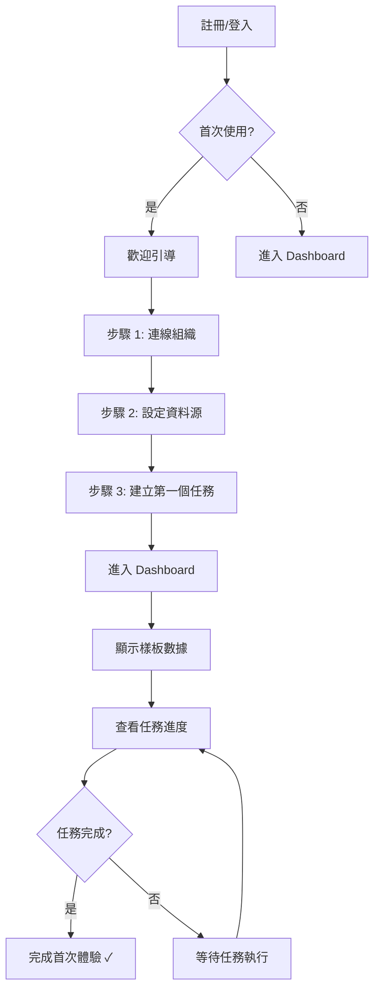
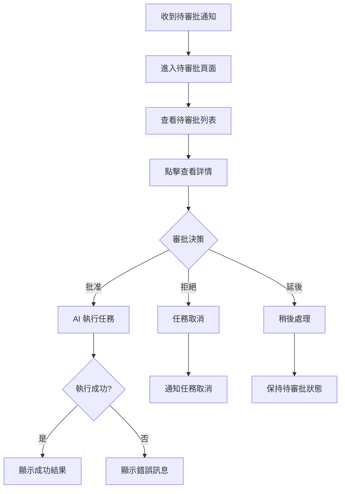

# 用戶流程文檔

## 概述

本目錄包含 MorningAI 平台的核心用戶流程文檔,涵蓋首次體驗、日常工作、付費升級等關鍵旅程。每個流程都包含詳細的步驟、決策點、錯誤處理與成功指標。

## 核心用戶流程

### 1. 首次體驗 (First-run Experience)
**目標**: 讓新用戶在 10 分鐘內完成首次任務

**流程**:
```
註冊/登入
  ↓
歡迎引導 (3 步驟)
  ├── 步驟 1: 連線組織
  ├── 步驟 2: 設定資料源
  └── 步驟 3: 建立第一個任務
  ↓
進入 Dashboard (顯示樣板數據)
  ↓
查看任務進度
  ↓
完成首次任務 ✓
```

**成功指標**:
- TTV (Time to Value) < 10 分鐘
- 完成率 > 80%
- 跳過率 < 30%

### 2. 儀表板自訂 (Dashboard Customization)
**目標**: 讓用戶根據需求自訂儀表板佈局

**流程**:
```
進入 Dashboard
  ↓
點擊「編輯」進入編輯模式
  ↓
自訂操作
  ├── 拖拽重新排列小工具
  ├── 移除不需要的小工具
  ├── 添加新小工具 (搜尋/分類)
  └── 調整小工具大小
  ↓
保存變更
  ├── 成功: 顯示「已保存」提示
  └── 失敗: 顯示錯誤訊息與重試按鈕
  ↓
退出編輯模式
```

**成功指標**:
- 自訂率 > 60%
- 保存成功率 > 95%
- 平均自訂時間 < 3 分鐘

### 3. 決策審批 (Decision Approval - HITL)
**目標**: 讓用戶快速審批 AI 決策

**流程**:
```
收到待審批通知 (Telegram/Dashboard 徽章)
  ↓
進入「待審批」頁面
  ↓
查看待審批列表
  ├── 風險等級 (高/中/低)
  ├── 預期影響
  ├── 信心度
  └── 追蹤 ID
  ↓
點擊查看詳情
  ├── 完整描述
  ├── 變更預覽 (如 PR diff)
  └── 相關資訊
  ↓
審批決策
  ├── 批准 → AI 執行任務
  ├── 拒絕 → 任務取消
  └── 延後 → 稍後處理
  ↓
查看執行結果
```

**成功指標**:
- 審批時間中位數 < 2 分鐘
- 批准率 > 70%
- 錯誤批准率 < 5%

### 4. 成本管理 (Cost Management)
**目標**: 讓用戶了解並控制 API 使用成本

**流程**:
```
進入「成本分析」頁面
  ↓
查看成本總覽
  ├── 今日成本
  ├── 本月成本
  ├── 成本節省
  └── 配額剩餘
  ↓
查看成本趨勢
  ├── 過去 30 天趨勢圖
  ├── 按服務分類 (OpenAI, Supabase, Redis)
  └── 異常標註
  ↓
設定預警
  ├── 每日預算上限
  ├── 配額警告閾值
  └── 通知方式 (Email, Slack)
  ↓
收到超限預警
  ├── 暫停自動執行
  ├── 升級方案
  └── 調整使用策略
```

**成功指標**:
- 成本可見性 > 90%
- 超限預警準確率 > 95%
- 成本優化率 > 15%

### 5. 付費升級 (Upgrade Flow)
**目標**: 讓用戶順利完成付費升級

**流程**:
```
觸發升級入口
  ├── 配額用盡
  ├── 功能限制
  └── 團隊規模限制
  ↓
查看方案比較
  ├── 免費版
  ├── 專業版
  └── 企業版
  ↓
選擇方案
  ↓
進入結帳頁面
  ├── 填寫帳單資訊
  ├── 選擇付款方式 (Stripe/TapPay)
  └── 確認訂閱
  ↓
付款處理
  ├── 成功 → 立即解鎖功能
  └── 失敗 → 顯示錯誤訊息與重試
  ↓
確認頁面
  ├── 訂閱詳情
  ├── 收據
  └── 下一步建議
```

**成功指標**:
- 轉化率 > 5%
- 付款成功率 > 95%
- 升級後留存率 > 80%

## 錯誤處理流程

### 網路錯誤
```
API 請求失敗
  ↓
顯示錯誤提示
  ├── 錯誤圖示
  ├── 錯誤描述: "網路連線失敗"
  └── 操作按鈕: "重試"
  ↓
用戶點擊「重試」
  ├── 成功 → 繼續流程
  └── 失敗 → 顯示「聯繫支援」選項
```

### 權限錯誤
```
訪問受限功能
  ↓
顯示權限錯誤
  ├── 錯誤圖示
  ├── 錯誤描述: "您沒有權限訪問此功能"
  └── 操作按鈕
      ├── "升級方案" (如為功能限制)
      └── "聯繫管理員" (如為角色限制)
```

### 驗證錯誤
```
表單提交失敗
  ↓
顯示驗證錯誤
  ├── 標記錯誤欄位 (紅色邊框)
  ├── 顯示錯誤訊息 (欄位下方)
  └── 焦點移至第一個錯誤欄位
  ↓
用戶修正錯誤
  ↓
即時驗證
  ├── 正確 → 移除錯誤標記
  └── 錯誤 → 保持錯誤標記
```

## 流程圖示例

### 首次體驗流程圖



### 決策審批流程圖



## 設計原則

### 1. 最短路徑
- 減少步驟數量
- 避免不必要的確認
- 提供快捷操作

### 2. 清楚反饋
- 即時狀態更新
- 明確的成功/失敗訊息
- 進度指示器

### 3. 錯誤恢復
- 清楚的錯誤訊息
- 提供解決方案
- 一鍵重試

### 4. 可撤銷
- 支援撤銷/重做
- 確認危險操作
- 保存草稿

## 測試與驗證

### 可用性測試

**測試任務**:
1. 完成首次體驗流程
2. 自訂儀表板佈局
3. 審批一個待審批任務
4. 查看成本分析
5. 升級到專業版

**測試指標**:
- 任務完成率
- 完成時間
- 錯誤次數
- SUS 分數

### A/B 測試

**測試項目**:
1. 引導流程步驟數 (3 步 vs 5 步)
2. 儀表板預設佈局
3. 審批頁面佈局 (列表 vs 卡片)
4. 升級入口位置

**測試指標**:
- 轉化率
- 完成率
- 用戶滿意度

## 版本歷史

| 版本 | 日期 | 變更內容 | 作者 |
|------|------|----------|------|
| 1.0.0 | 2025-10-20 | 初版建立 | UI/UX 設計團隊 |
