# ADR-004: Shared Core Executor Pattern

**Status**: Accepted  
**Date**: 2025-11-24  
**Deciders**: CTO, Engineering Team  
**Related**: ADR-005, ADR-002, PR #1520

---

## Context

MorningAI's Worker Orchestrator operates in a dual-mode architecture with two execution paths:

1. **Simple Mode** (~95% traffic)
   - Direct execution path
   - Feature-frozen (bug fixes only)
   - Stable baseline for production

2. **LangGraph Mode** (~5% traffic)
   - LangGraph-based workflow engine
   - Active development path
   - Innovation and new features

Both modes need to execute agent tasks with consistent behavior. The key architectural question is: **Should each mode have its own execution engine, or should they share a common core?**

### Current Implementation

The codebase currently uses a **shared core executor pattern**:
- `graph.execute()` function in `handoff/20250928/40_App/orchestrator/graph.py:30`
- Simple mode calls `graph.execute()` directly
- LangGraph mode calls `graph.execute()` through an executor node
- Both modes produce identical execution behavior

This pattern emerged organically during the Phase 1 canary deployment implementation but was never formally documented as an architectural decision.

### The Problem

Without formal documentation of this pattern, developers face:
- **Confusion**: Is `graph.py` the "old orchestrator" or a shared component?
- **Testing Gaps**: Developers might test only one mode when modifying `graph.execute()`
- **Refactoring Risk**: Phase 3 refactoring decisions lack historical context
- **Onboarding Difficulty**: New engineers don't understand why this pattern was chosen

---

## Decision

We formally adopt the **Shared Core Executor Pattern** for the dual-mode orchestrator architecture.

### Definition

The Shared Core Executor Pattern means:
- `graph.execute()` is the canonical execution engine for both modes
- Simple mode and LangGraph mode are **routing wrappers** around the shared core
- Modifications to `graph.execute()` affect both modes equally
- The shared core is NOT "legacy code" but an active, maintained component

### Implementation Details

**Shared Core Executor** (`graph.py:30-155`):
```python
def execute(goal: str, repo_full: str, trace_id: Optional[str] = None):
    # Core execution logic used by BOTH modes
    # - Cost tracking
    # - Reputation management
    # - Agent coordination
    # - Task execution
```

**Simple Mode** (`worker.py:399-400`):
```python
from graph import execute
logger.info(f"Using simple orchestrator for task {task_id}")
# Direct call to shared core
```

**LangGraph Mode** (`langgraph_orchestrator.py:143`):
```python
from graph import execute
# Called through executor_node in LangGraph workflow
```

**Routing Decision** (`worker.py:366-395`):
- MD5-based deterministic routing
- Controlled by `USE_LANGGRAPH_PERCENT` (0-100)
- Decision made at worker level, not API level

### Architecture Diagram

```mermaid
graph TB
    A[HTTP Request] --> B[API Backend<br/>morningai-backend-v2]
    B --> C[Redis Queue<br/>orchestrator queue]
    C --> D[Worker<br/>morningai-agent-worker]
    D --> E{Routing Decision<br/>MD5 Hash % 100}
    E -->|"default traffic"| F[Simple Mode<br/>Feature-frozen]
    E -->|"canary traffic"| G[LangGraph Mode<br/>Active development]
    F --> H[graph.execute&#40;&#41;<br/>Shared Core Executor]
    G --> I[LangGraph Workflow]
    I --> J[executor_node]
    J --> H
    H --> K[Task Execution<br/>Agent Coordination]
    
    style F fill:#e1f5ff,stroke:#0288d1,stroke-width:2px
    style G fill:#fff4e1,stroke:#f57c00,stroke-width:2px
    style H fill:#e8f5e9,stroke:#388e3c,stroke-width:3px
    style E fill:#f3e5f5,stroke:#7b1fa2,stroke-width:2px
    style K fill:#fff3e0,stroke:#e65100,stroke-width:2px
```



**Key Components**:
- **API Backend**: Receives requests, enqueues tasks to Redis
- **Worker**: Dequeues tasks, makes routing decision
- **Routing Decision**: MD5-based deterministic routing using task_id
- **Simple Mode**: Direct execution path (feature-frozen)
- **LangGraph Mode**: Workflow-based execution (active development)
- **Shared Core**: `graph.execute()` used by both modes

---

## Rationale

### Why Shared Core?

**1. Code Reuse**
- Avoids duplicating complex execution logic
- Single source of truth for core functionality
- Reduces maintenance burden

**2. Behavioral Consistency**
- Both modes produce identical execution results
- Easier to validate correctness
- Simplifies testing and debugging

**3. Migration Safety**
- Gradual migration from Simple to LangGraph mode
- Shared core ensures no behavioral regressions
- Easy rollback if LangGraph mode has issues

**4. Testing Efficiency**
- Core execution logic tested once
- Mode-specific tests focus on routing and workflow
- Reduces test duplication

### Why NOT Complete Separation?

**Alternative: Each mode has its own executor**

**Pros**:
- Complete independence between modes
- No coupling between Simple and LangGraph
- Easier to refactor one mode without affecting the other

**Cons**:
- Code duplication (2x maintenance)
- Risk of behavioral divergence
- Difficult to ensure consistency
- Higher testing burden
- Migration complexity (need to verify both executors)

**Decision**: The cons outweigh the pros for Phase 1-2. Complete separation may be reconsidered in Phase 3.

### Decision Flow Diagram

```mermaid
flowchart TD
    Start[Task Arrives at Worker] --> GetID[Extract task_id]
    GetID --> CheckFlag{USE_LANGGRAPH<br/>== true?}
    CheckFlag -->|Yes| LangGraph[Route to LangGraph Mode]
    CheckFlag -->|No| CheckPercent{Calculate<br/>MD5 Hash % 100}
    CheckPercent -->|"< USE_LANGGRAPH_PERCENT"| Simple[Route to Simple Mode]
    CheckPercent -->|">= USE_LANGGRAPH_PERCENT"| LangGraph
    Simple --> SimpleLog[Log: Using simple orchestrator]
    LangGraph --> LangGraphLog[Log: Using LangGraph orchestrator]
    SimpleLog --> Execute[Call graph.execute&#40;&#41;]
    LangGraphLog --> Workflow[Execute LangGraph Workflow]
    Workflow --> ExecutorNode[executor_node]
    ExecutorNode --> Execute
    Execute --> Done[Task Complete]
    
    style CheckFlag fill:#f3e5f5,stroke:#7b1fa2
    style CheckPercent fill:#f3e5f5,stroke:#7b1fa2
    style Simple fill:#e1f5ff,stroke:#0288d1
    style LangGraph fill:#fff4e1,stroke:#f57c00
    style Execute fill:#e8f5e9,stroke:#388e3c,stroke-width:3px
```



---

## Consequences

### Positive

- ✅ **Code Reuse**: Single implementation of core execution logic
- ✅ **Consistency**: Both modes behave identically
- ✅ **Testing Efficiency**: Core logic tested once
- ✅ **Migration Safety**: Gradual transition with stable baseline
- ✅ **Maintenance**: Single codebase for core functionality

### Negative

- ⚠️ **Coupling**: Modifications to `graph.execute()` affect both modes
- ⚠️ **Testing Complexity**: Must test both modes when modifying shared core
- ⚠️ **Refactoring Constraints**: Phase 3 refactoring must handle both modes
- ⚠️ **Developer Confusion**: Need clear documentation that `graph.py` is shared

### Mitigation Strategies

1. **Documentation**: This ADR + updated ONBOARDING_GUIDE.md (PR #1520)
2. **Testing Requirements**: Explicit requirement to test both modes when modifying `graph.execute()`
3. **Code Comments**: Clear comments in `graph.py` indicating shared usage
4. **PR Guidelines**: Reviewers check for dual-mode testing
5. **Phase 3 Planning**: Document refactoring options with trade-offs

---

## Performance Impact

### Execution Performance

**Shared Core Overhead**:
- **Negligible**: Both modes call the same `graph.execute()` function
- **No additional latency**: Direct function call (Simple) vs single-hop through executor_node (LangGraph)
- **Memory**: Single copy of execution logic in memory

**Measured Impact** (Phase 1 Canary):
- Simple Mode: ~2-3 seconds per task (baseline)
- LangGraph Mode: ~2-4 seconds per task (+0-1s for workflow overhead)
- Shared Core: 0ms additional overhead (same execution path)

**Routing Decision Overhead**:
- MD5 hash calculation: <1ms
- Percentage comparison: <1ms
- Total routing overhead: <2ms (negligible)

### Resource Utilization

**Memory**:
- Shared Core: ~50MB (loaded once per worker)
- Simple Mode: No additional memory
- LangGraph Mode: +~100MB for LangGraph state machine
- **Total Savings**: ~50MB per worker (vs duplicated executors)

**CPU**:
- Shared Core: Same CPU usage for both modes
- LangGraph Mode: +5-10% CPU for workflow management
- No CPU overhead from sharing

### Scalability

**Current Load** (Phase 1):
- Default: 100% Simple Mode (USE_LANGGRAPH_PERCENT=0)
- Staging: 15% LangGraph Mode canary testing
- Worker capacity: ~10-20 concurrent tasks per worker

**Projected Load** (Phase 2 - 50/50 split):
- Expected: No performance degradation
- Reason: Shared core performance is identical
- Bottleneck: LangGraph workflow overhead, not shared core

**Projected Load** (Phase 3 - 100% LangGraph):
- Expected: +5-10% latency vs current Simple Mode
- Reason: LangGraph workflow overhead, not shared core
- Mitigation: Optimize LangGraph workflow, not shared core

### Performance Monitoring

**Key Metrics**:
- `task_execution_time`: End-to-end task duration
- `graph_execute_time`: Time spent in shared core
- `routing_decision_time`: Time spent in routing logic
- `langgraph_workflow_time`: Time spent in LangGraph workflow

**Monitoring Locations**:
- Logs: `planner_runs.jsonl` (includes timing data)
- Metrics: Redis counters (`decisions.langgraph`, `decisions.simple`)
- Traces: `trace_id` propagation for distributed tracing

**Performance Alerts**:
- Alert if `graph_execute_time` > 5 seconds (P2)
- Alert if `routing_decision_time` > 100ms (P3)
- Alert if LangGraph mode error rate > 20% (P1)

---

## Rollback Procedures

### Scenario 1: LangGraph Mode Issues (Most Common)

**Symptoms**:
- High error rate in LangGraph mode (>20%)
- Timeout issues in LangGraph workflow
- Incorrect task execution results

**Rollback Steps**:

1. **Immediate Rollback** (< 2 minutes):
   ```bash
   # In Render Dashboard → morningai-agent-worker → Environment
   USE_LANGGRAPH_PERCENT = 0  # Route 100% to Simple Mode
   # Save and redeploy (auto-restart)
   ```

2. **Verify Rollback**:
   - Check worker logs in Render Dashboard
   - Search for "Using simple orchestrator" (should be 100%)
   - Search for "Using LangGraph orchestrator" (should be 0)

3. **Monitor**:
   - Watch error rate drop to baseline (<5%)
   - Verify task completion rate returns to normal
   - Check `decisions.simple` counter increases

**Recovery Time**: < 5 minutes (2 min rollback + 3 min verification)

### Scenario 2: Shared Core Issues (Rare but Critical)

**Symptoms**:
- Both modes experiencing errors
- `graph.execute()` throwing exceptions
- Task execution failures across all traffic

**Rollback Steps**:

1. **Identify Bad Commit**:
   ```bash
   git log --oneline handoff/20250928/40_App/orchestrator/graph.py
   # Find last known good commit
   ```

2. **Revert Changes**:
   ```bash
   git revert <bad_commit_hash>
   git push origin main
   ```

3. **Deploy**:
   ```bash
   # Render auto-deploys from main branch
   # Monitor deployment in Render Dashboard
   ```

4. **Verify**:
   ```bash
   # Test both modes
   pytest tests/test_persistence_db_writer.py  # Simple mode
   pytest tests/test_langgraph_smoke.py  # LangGraph mode
   ```

**Recovery Time**: 10-15 minutes (5 min revert + 5 min deploy + 5 min verification)

### Scenario 3: Routing Logic Issues

**Symptoms**:
- Incorrect traffic distribution (not matching `USE_LANGGRAPH_PERCENT`)
- Tasks routing to wrong mode
- Non-deterministic routing (same task_id → different modes)

**Rollback Steps**:

1. **Force 100% Simple Mode**:
   ```bash
   # In Render Dashboard → morningai-agent-worker → Environment
   USE_LANGGRAPH = false
   USE_LANGGRAPH_PERCENT = 0
   ```

2. **Investigate**:
   ```bash
   # Check routing logic in worker logs (Render Dashboard)
   # Search for "Canary deployment" keyword
   # Verify MD5 hash calculation
   pytest tests/test_worker.py -k canary -v
   ```

3. **Fix and Redeploy**:
   - Fix routing logic in `worker.py:366-395`
   - Test locally with various percentages
   - Deploy fix

**Recovery Time**: 15-30 minutes (2 min rollback + 10-25 min investigation/fix + 3 min verification)

### Scenario 4: Complete Worker Failure

**Symptoms**:
- Worker crashes on startup
- All tasks failing
- Redis queue backing up

**Rollback Steps**:

1. **Rollback to Last Known Good Deployment**:
   ```bash
   # In Render Dashboard → morningai-agent-worker → Manual Deploy
   # Select previous successful deployment
   # Click "Deploy"
   ```

2. **Verify**:
   ```bash
   # Check worker is processing tasks
   redis-cli LLEN orchestrator  # Queue length should decrease
   ```

3. **Investigate**:
   - Check deployment logs for errors
   - Review recent commits
   - Test locally

**Recovery Time**: 5-10 minutes (3 min rollback + 2-7 min verification)

### Rollback Decision Matrix

| Scenario | Severity | Rollback Method | Recovery Time | Risk |
|----------|----------|-----------------|---------------|------|
| LangGraph Mode Issues | P2 | Set `USE_LANGGRAPH_PERCENT=0` | < 5 min | Low |
| Shared Core Issues | P1 | Git revert + redeploy | 10-15 min | Medium |
| Routing Logic Issues | P2 | Force Simple Mode + fix | 15-30 min | Low |
| Complete Worker Failure | P0 | Rollback deployment | 5-10 min | High |

### Rollback Testing

**Pre-Production Testing**:
- Test rollback procedures in staging environment
- Verify `USE_LANGGRAPH_PERCENT=0` works as expected
- Practice git revert workflow

**Rollback Drills**:
- Quarterly rollback drill (simulate LangGraph failure)
- Document actual recovery time
- Update procedures based on learnings

### Post-Rollback Actions

1. **Incident Report**:
   - Document what went wrong
   - Root cause analysis
   - Preventive measures

2. **Fix and Re-Deploy**:
   - Fix the issue locally
   - Test thoroughly (both modes)
   - Gradual re-enable (start with 1%, then 5%, then target %)

3. **Monitoring**:
   - Watch metrics closely for 24 hours
   - Be ready to rollback again if needed

---

## Alternatives Considered

### Alternative 1: Complete Separation

**Description**: Simple mode and LangGraph mode each have their own execution engine.

**Pros**:
- Complete independence
- No coupling between modes
- Easier to refactor one mode

**Cons**:
- Code duplication
- Behavioral divergence risk
- Higher maintenance burden
- Complex migration validation

**Decision**: **Rejected** for Phase 1-2. May reconsider in Phase 3 if LangGraph mode reaches 100% traffic and proves stable.

---

### Alternative 2: LangGraph 100% Replacement

**Description**: Remove Simple mode entirely, use only LangGraph mode.

**Pros**:
- Single execution path
- No dual-mode complexity
- Simplified architecture

**Cons**:
- High risk (no stable baseline)
- Difficult rollback
- Requires LangGraph mode to be production-ready
- No gradual migration path

**Decision**: **Rejected**. Canary deployment requires a stable baseline (Simple mode) for comparison and rollback.

---

### Alternative 3: Abstract Executor Interface

**Description**: Define `ExecutorInterface`, both modes implement it.

**Pros**:
- Clean abstraction
- Flexible implementation
- Supports multiple executors

**Cons**:
- Over-engineering for current needs
- Adds complexity without clear benefit
- Still requires shared logic (duplication or composition)

**Decision**: **Rejected**. YAGNI (You Aren't Gonna Need It). Current shared core pattern is simpler and sufficient.

---

### Alternative 4: Shared Core (Current Choice) ✅

**Description**: `graph.execute()` as shared core, modes are routing wrappers.

**Pros**:
- Code reuse
- Behavioral consistency
- Testing efficiency
- Migration safety

**Cons**:
- Coupling between modes
- Testing complexity (must test both)

**Decision**: **Accepted**. Best balance of simplicity, safety, and maintainability for Phase 1-2.

---

## Phase 3 Refactoring Options

When LangGraph mode reaches 100% traffic and runs stably for 3+ months, consider:

### Option 1: Keep Shared Core

**When**: If `graph.execute()` still meets all requirements

**Action**: No refactoring needed

**Pros**:
- Zero risk
- No migration cost
- Proven stability

**Cons**:
- Maintains dual-mode complexity
- Long-term maintenance burden

---

### Option 2: Migrate to LangGraph Native

**When**: LangGraph mode is stable and proven at 100% traffic

**Action**: 
1. Migrate `graph.execute()` logic into LangGraph native nodes
2. Remove Simple mode code
3. Remove routing logic

**Pros**:
- Simplified architecture (single mode)
- Remove dual-mode complexity
- Full LangGraph feature utilization

**Cons**:
- High refactoring cost
- Extensive testing required
- Risk of regressions

**Estimated Effort**: 4-6 weeks

---

### Option 3: Abstract Executor Interface

**When**: Need to support multiple execution engines

**Action**:
1. Define `ExecutorInterface`
2. Implement `GraphExecutor` (current `graph.execute()`)
3. Implement `LangGraphNativeExecutor`
4. Support runtime switching

**Pros**:
- Maximum flexibility
- Support multiple executors
- Clean abstraction

**Cons**:
- Over-engineering risk
- Increased complexity
- Higher maintenance burden

**Estimated Effort**: 6-8 weeks

---

### Recommendation for Phase 3

**Start with Option 1** (Keep Shared Core):
- If `graph.execute()` works well, don't fix what isn't broken
- Evaluate after 3 months at 100% LangGraph traffic
- Only refactor if there's a clear business need

**Consider Option 2** if:
- LangGraph native features provide significant value
- Maintenance burden of dual-mode becomes too high
- Team has bandwidth for 4-6 week refactoring

**Avoid Option 3** unless:
- Clear requirement for multiple execution engines emerges
- Current architecture becomes a bottleneck

---

## Development Guidelines

### When Modifying `graph.execute()`

**Required Steps**:
1. ✅ Understand that changes affect BOTH modes
2. ✅ Test Simple mode: `USE_LANGGRAPH=false USE_LANGGRAPH_PERCENT=0`
3. ✅ Test LangGraph mode: `USE_LANGGRAPH=true`
4. ✅ Test canary routing: `USE_LANGGRAPH=false USE_LANGGRAPH_PERCENT=5`
5. ✅ Update tests in both `test_persistence_db_writer.py` and `test_langgraph_smoke.py`
6. ✅ Document behavioral changes in PR description

**Common Mistakes**:
- ❌ Assuming `graph.py` is "legacy" or "old orchestrator"
- ❌ Testing only one mode
- ❌ Adding mode-specific logic to shared core
- ❌ Modifying without understanding dual-mode impact

---

### When Adding New Features

**Simple Mode** (Feature-Frozen):
- ❌ Do NOT add new features
- ✅ Bug fixes only
- ✅ Security patches only

**LangGraph Mode** (Active Development):
- ✅ Add new features here
- ✅ Implement in LangGraph workflow nodes
- ✅ Can call `graph.execute()` for core execution

**Shared Core** (`graph.execute()`):
- ⚠️ Only modify if needed by BOTH modes
- ⚠️ Requires testing both modes
- ⚠️ Requires CTO approval for major changes

---

## Monitoring and Observability

### Key Metrics

**Routing Decisions**:
- `decisions.langgraph`: Count of LangGraph mode selections
- `decisions.simple`: Count of Simple mode selections
- Target ratio: ~5:95 (Phase 1)

**Execution Behavior**:
- `trace_id`: Track execution across both modes
- `planner_type`: Identify which planner was used (llm/static)
- `planning_time_ms`: Compare performance between modes

### Log Search Keywords

| Keyword | Purpose |
|---------|---------|
| `"Using LangGraph orchestrator"` | Find LangGraph mode executions |
| `"Using simple orchestrator"` | Find Simple mode executions |
| `"Canary deployment"` | Find routing decisions |
| `"task_percent"` | Find task routing percentages |

---

## Testing Strategy

### Unit Tests

**Shared Core Tests** (`test_persistence_db_writer.py`):
- Test `graph.execute()` directly
- Mock external dependencies
- Focus on core execution logic

**LangGraph Tests** (`test_langgraph_smoke.py`):
- Test LangGraph workflow
- Verify executor node calls `graph.execute()`
- Test LangGraph-specific features

**Observability Tests**:
- Verify `trace_id` propagation in integration tests
- Verify `planner_type` recording in LangGraph tests
- Test metrics collection in worker tests

### Integration Tests

**Canary Routing Tests**:
- Verify MD5-based routing
- Test percentage thresholds (0%, 5%, 50%, 100%)
- Verify deterministic behavior (same task_id → same mode)

**End-to-End Tests**:
- Test complete request flow (API → Redis → Worker → Execution)
- Verify both modes produce identical results
- Test rollback scenarios

---

## Related Documentation

- [ONBOARDING_GUIDE.md - Orchestrator Architecture](../ONBOARDING_GUIDE.md#orchestrator-architecture)
- [PROJECT_STRUCTURE_REPORT.md - Orchestrator System](../PROJECT_STRUCTURE_REPORT.md#orchestrator-system)
- [ENVIRONMENTS.md - Orchestrator Configuration](../ENVIRONMENTS.md#orchestrator-configuration)
- [ADR-005: Dual Orchestrator Architecture](./005-dual-orchestrator-architecture.md)
- [ADR-002: Producer-Consumer Architecture](./002-producer-consumer-architecture.md)
- [PR #1520: Document Orchestrator Architecture](https://github.com/RC918/morningai/pull/1520)

---

## References

**Code Locations**:
- Shared Core: `handoff/20250928/40_App/orchestrator/graph.py:30-155`
- Routing Logic: `handoff/20250928/40_App/orchestrator/redis_queue/worker.py:366-395`
- Simple Mode Call: `handoff/20250928/40_App/orchestrator/redis_queue/worker.py:399-400`
- LangGraph Mode Call: `handoff/20250928/40_App/orchestrator/langgraph_orchestrator.py:143`
- Settings: `common/config/settings.py:890-908`

**Environment Variables**:
- `USE_LANGGRAPH`: Master switch (default: `false`)
- `USE_LANGGRAPH_PERCENT`: Canary percentage 0-100 (default: `0`)
- `USE_LLM_PLANNER`: LLM vs static planner (default: `false`, LangGraph only)

---

## Review Schedule

- **2025-12-24**: Review Phase 1 metrics (1 month after ADR)
- **2026-02-24**: Review Phase 2 progress (3 months after ADR)
- **2026-05-24**: Evaluate Phase 3 refactoring options (6 months after ADR)

---

**Last Updated**: 2025-11-24  
**Next Review**: 2025-12-24
