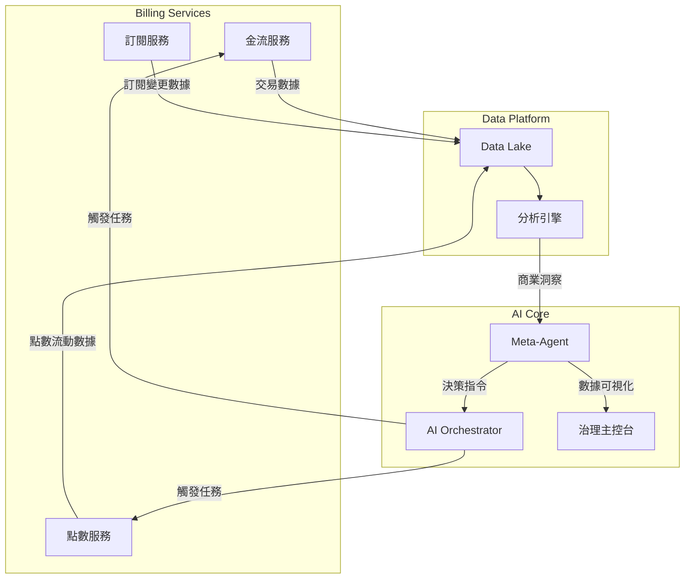

# Morning AI - 自治 SaaS 系統的金流架構優化方案

**版本**: 2.0
**日期**: 2025-09-12

---

## 1. 核心理念：從「被動收費」到「智能商業決策」

傳統的金流系統是被動的，僅在用戶發起購買時才觸發。在 Morning AI 的自治 SaaS 框架下，金流系統將升級為一個**具備主動決策能力的智能商業引擎**。它不僅處理交易，更能**理解、預測、並主動優化**商業流程，成為 Meta-Agent 系統的核心決策依據之一。

## 2. 架構升級：金流數據與 AI Orchestrator 的雙向整合

### 2.1. 數據流整合

金流與點數服務將成為 **AI Orchestrator** 的核心數據源。所有交易、訂閱、點數流動數據都會被結構化，並實時推送到 **Data Lake**，供 Meta-Agent 進行分析。

### 2.2. 控制流整合

**AI Orchestrator** 將具備直接調用金流與點數服務的能力，執行由 **Meta-Agent** 制定的商業策略。

- **場景示例1：智能挽留 (Smart Churn Prevention)**
  1.  **Meta-Agent** 監測到某高價值用戶取消了訂閱。
  2.  **Meta-Agent** 決策系統分析該用戶的歷史行為，決定提供一個「7折優惠 + 5000點數」的挽留方案。
  3.  **Meta-Agent** 向 **Orchestrator** 下達指令：「為 User #123 創建一個一次性的 7 折優惠券，並獎勵 5000 點數」。
  4.  **Orchestrator** 調用**金流服務**創建優惠券，並調用**點數服務**增加用戶點數。
  5.  **Orchestrator** 觸發**通知服務**，向用戶發送個性化的挽留郵件。

- **場景示例2：動態定價 (Dynamic Pricing)**
  1.  **Meta-Agent** 分析市場需求和用戶行為，發現在週末下午 AI Agent 的使用率較低。
  2.  **Meta-Agent** 決定在該時段推出「點數消耗 8 折」的限時優惠，以提高資源利用率。
  3.  **Orchestrator** 自動更新**點數服務**的計費規則，並觸發**前端服務**在點數中心顯示限時優惠橫幅。

## 3. AI 治理主控台的金融儀表板

治理主控台將新增一個「**智能金融儀表板 (Intelligent Finance Dashboard)**」，提供以下功能：

- **實時 LTV / CAC 追蹤**: 實時計算並可視化每個獲客渠道的用戶終身價值 (LTV) 和客戶獲取成本 (CAC)，幫助 Meta-Agent 評估渠道效益。
- **流失預測與歸因**: 基於機器學習模型，預測未來 30 天內可能流失的高價值用戶，並分析其流失原因（如：支付失敗、功能使用率低）。
- **商業策略模擬器**: 允許運營人員輸入假設的商業策略（如：「如果我們將 Pro Plan 價格提高 10%，並增加 20% 的點數獎勵，預計對收入和用戶流失率有何影響？」），由 Meta-Agent 進行沙盒推演並給出預測報告。
- **收入健康度儀表盤**: 監控 MRR (月度經常性收入)、Churn Rate (流失率)、ARPU (每用戶平均收入) 等核心指標，並在指標異常時自動告警。

## 4. 安全性強化：AI 驅動的風險控制

- **智能反欺詐系統**: Meta-Agent 會分析交易行為模式，識別異常的支付請求（如：短時間內來自不同地區的多筆小額支付），並自動觸發二次驗證或暫時凍結交易，交由人工審核。
- **信用卡盜刷預警**: 當系統檢測到某張信用卡的失敗率異常增高時，會自動將其加入臨時觀察名單，並通知風險控制團隊。

## 5. 最終整合方案

通過以上設計，金流與點數系統不再是一個孤立的後端模組，而是深度融入 Morning AI 自治大腦的核心組件。它為平台提供了從數據洞察到智能決策，再到自動執行的完整商業閉環，使 Morning AI 真正成為一個能夠自我優化、自我成長的智能商業體。

**總結**: 我們將金流從一個「工具」升級為一個「夥伴」，一個能夠與 AI 共同制定和執行商業策略的智能夥伴。

