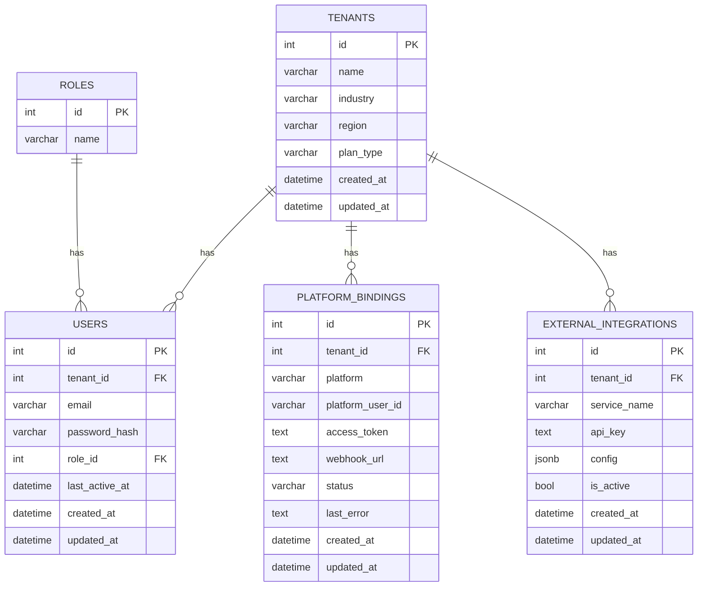

# Morning AI 資料庫與服務器架構設計

## 1. 資料庫架構

### 1.1. 資料庫選型

- **主要資料庫**: PostgreSQL 16
- **向量資料庫**: pgvector (PostgreSQL 擴展)
- **緩存資料庫**: Redis 7

### 1.2. 資料庫設計 (ERD)

### 1.3. 資料庫部署

- **生產環境**: 建議使用雲端託管的 PostgreSQL 服務，例如 AWS RDS、Google Cloud SQL 或 Supabase。
- **開發環境**: 使用 Docker Compose 啟動 PostgreSQL 容器。

## 2. 服務器架構

### 2.1. 服務器選型

- **前端服務器**: Vercel
- **後端服務器**: AWS Fargate 或 Google Cloud Run
- **異步任務處理**: AWS SQS + Celery Workers on Fargate

### 2.2. 服務器部署

- **前端部署**: 通過 Vercel 的 Git 集成，自動從 GitHub 拉取程式碼並部署。
- **後端部署**: 將 FastAPI 應用打包成 Docker 鏡像，並推送到 ECR 或 GCR，然後通過 Fargate 或 Cloud Run 進行部署。

### 2.3. 服務器配置

#### 生產環境

- **前端**: Vercel Pro Plan
- **後端**: 至少 2 個 vCPU，4GB RAM 的容器實例，並根據負載自動擴展。
- **資料庫**: 至少 2 個 vCPU，8GB RAM 的資料庫實例，並啟用高可用性模式。

#### 開發環境

- 使用 Docker Compose 在本地啟動所有服務。

## 3. 網域規劃

- **用戶儀表板**: `app.morningai.me`
- **管理後台**: `admin.morningai.me`
- **API 服務**: `api.morningai.me`

所有網域都通過 Cloudflare 進行管理，並啟用 CDN 和 WAF 功能。

