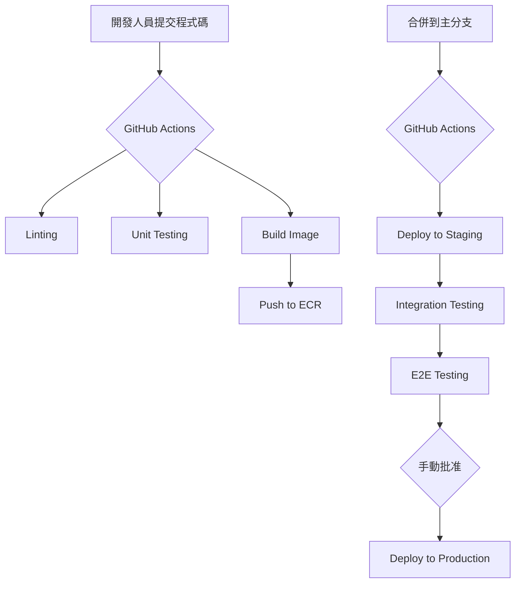

# Morning AI 部署與基礎設施規劃

## 1. 部署環境

我們將設置三個獨立的部署環境，以確保開發、測試和生產的穩定性。

- **開發環境 (Development)**: 開發人員在本地機器上使用 Docker Compose 運行。
- **預備環境 (Staging)**: 用於在部署到生產環境之前進行測試和驗收。
- **生產環境 (Production)**: 面向最終用戶的穩定版本。

| 環境 | 用途 | 部署方式 | 資源配置 |
|---|---|---|---|
| 開發 | 功能開發和單元測試 | Docker Compose | 本地資源 |
| 預備 | 整合測試和用戶驗收 | AWS Fargate / Vercel | 較小規模的雲資源 |
| 生產 | 穩定服務 | AWS Fargate / Vercel | 高可用性的雲資源 |

## 2. CI/CD 流程

我們將使用 GitHub Actions 實現自動化的持續整合和持續部署 (CI/CD) 流程。

### 2.1. CI 流程 (每次提交)

1. **程式碼檢查 (Linting)**: 檢查程式碼風格和語法錯誤。
2. **單元測試 (Unit Testing)**: 運行單元測試，確保程式碼邏輯正確。
3. **構建鏡像 (Build Image)**: 構建 Docker 鏡像，並推送到 ECR。

### 2.2. CD 流程 (合併到主分支)

1. **部署到預備環境**: 自動將最新的 Docker 鏡像部署到預備環境。
2. **自動化測試**: 在預備環境中運行整合測試和 E2E 測試。
3. **手動部署到生產環境**: 在所有測試通過後，手動觸發部署到生產環境。

## 3. 基礎設施即程式碼 (IaC)

我們將使用 Terraform 來管理我們的雲基礎設施，以實現基礎設施的自動化、可重複和版本控制。

### 3.1. Terraform 管理的資源

- **網絡**: VPC, Subnets, Security Groups
- **計算**: Fargate Services, Task Definitions
- **資料庫**: RDS Instances, Parameter Groups
- **負載均衡**: Application Load Balancers, Target Groups
- **DNS**: Route 53 Records

## 4. 監控與告警

我們將建立全面的監控和告警系統，以確保系統的穩定性和性能。

### 4.1. 監控工具

- **指標監控**: Prometheus + Grafana
- **日誌監控**: ELK Stack (Elasticsearch, Logstash, Kibana)
- **錯誤追蹤**: Sentry
- **可用性監控**: UptimeRobot

### 4.2. 核心監控指標

- **API P95 延遲**: < 500ms
- **API 錯誤率**: < 1%
- **資料庫連線池使用率**: < 80%
- **CPU / 記憶體使用率**: < 80%

### 4.3. 告警機制

- 當任何核心指標超過閾值時，自動發送告警到 Slack 的 `#morningai-alerts` 頻道。
- 設置 on-call 輪值制度，確保在非工作時間也能及時響應告警。

## 5. 備份與災難恢復

### 5.1. 備份策略

- **資料庫備份**: 每日自動備份，並保留最近 30 天的備份。
- **程式碼備份**: 所有程式碼都存儲在 GitHub 上，並在多個地理位置進行備份。

### 5.2. 災難恢復計劃

- **RTO (恢復時間目標)**: 4 小時
- **RPO (恢復點目標)**: 24 小時

在發生災難時，我們將使用 Terraform 快速在另一個可用區或區域重建基礎設施，並從最新的備份中恢復數據。

