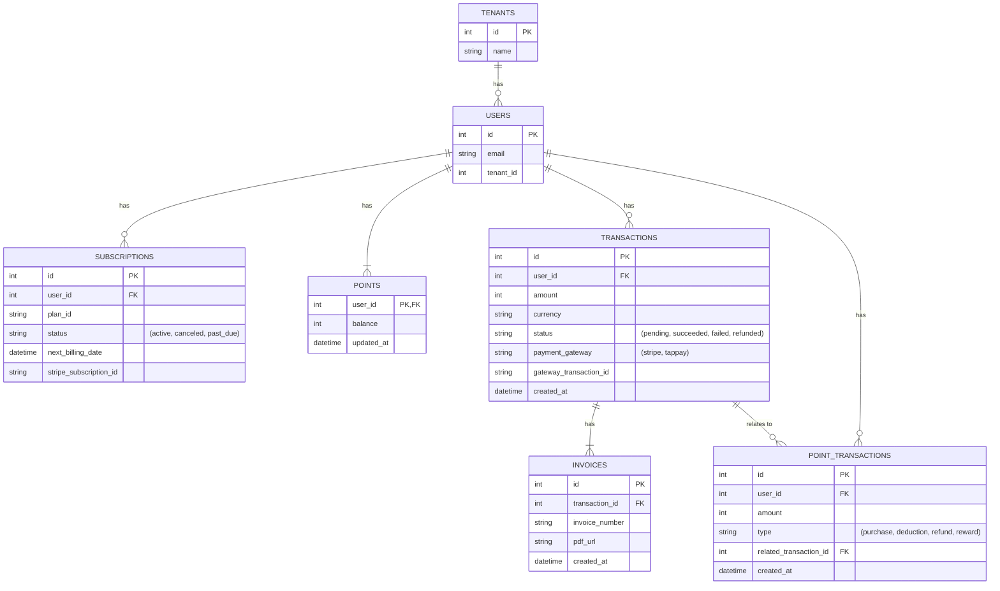

# Morning AI - 金流與點數系統完整設計方案

**版本**: 1.0
**日期**: 2025-09-12

---

## 1. 系統願景與目標

### 1.1. 願景

打造一個**彈性、安全、可擴展**的金流與點數系統，無縫整合到 Morning AI 的自治 SaaS 生態中，為用戶提供流暢的支付體驗，並為平台提供多樣化的商業變現能力。

### 1.2. 核心目標

- **用戶體驗**: 提供多種支付方式（信用卡、點數），簡化支付流程，實現點數的輕鬆獲取與使用。
- **商業模式**: 支持**訂閱制**、**點數消耗制**及**混合模式**，滿足不同用戶群體的需求。
- **系統整合**: 與現有的多租戶、AI Agent、治理主控台等模組深度整合，實現數據互通與流程自動化。
- **安全性**: 遵循 PCI DSS 標準，確保支付過程的絕對安全，保護用戶敏感數據。
- **可擴展性**: 架構設計需具備高擴展性，能夠輕鬆接入新的支付渠道（如 Apple Pay, Google Pay）和設計新的點數玩法。

---

## 2. 系統架構設計

### 2.1. 整體架構圖 (C4 Model - Level 2)

```mermaid
graph TD
    subgraph 用戶端 (Frontend - Next.js)
        A[支付頁面]
        B[訂閱管理頁]
        C[點數中心]
    end

    subgraph 後端 (Backend - FastAPI)
        D[API Gateway] --> E[金流服務]
        D --> F[點數服務]
        D --> G[訂閱服務]
    end

    subgraph 核心資料庫 (PostgreSQL)
        H[Transactions 表]
        I[Points 表]
        J[Subscriptions 表]
        K[Invoices 表]
    end

    subgraph 第三方服務
        L[Stripe]
        M[TapPay]
        N[SendGrid]
    end

    A --> D
    B --> D
    C --> D

    E --> L
    E --> M
    E --> H
    E --> K

    F --> I
    F --> H

    G --> J
    G --> E

    L --> E
    M --> E
    E --> N
```

### 2.2. 微服務職責劃分

- **金流服務 (Payment Service)**
  - **職責**: 處理所有與支付相關的操作，包括創建交易、處理支付回調、管理發票、與第三方支付網關（Stripe, TapPay）交互。
  - **技術棧**: FastAPI, Stripe SDK, TapPay SDK。

- **點數服務 (Point Service)**
  - **職責**: 管理用戶的點數餘額，包括點數的增加（加購、獎勵）、消耗（折抵、使用）、查詢和歷史記錄。
  - **技術棧**: FastAPI, SQLAlchemy。

- **訂閱服務 (Subscription Service)**
  - **職責**: 管理用戶的訂閱方案，包括訂閱的創建、續訂、取消、升級/降級，並在續訂時觸發金流服務創建新的交易。
  - **技術棧**: FastAPI, SQLAlchemy, Celery (用於定時任務)。

### 2.3. 資料庫設計 (ERD)



---

## 3. 核心功能與流程

### 3.1. 訂閱與支付流程

1.  **選擇方案**: 用戶在前端選擇訂閱方案 (e.g., Pro Plan)。
2.  **創建訂閱**: 前端調用**訂閱服務**的 `POST /subscriptions` API。
3.  **創建交易**: **訂閱服務**計算應付金額，並調用**金流服務**的 `POST /payments/checkout` API，請求創建一個 `pending` 狀態的交易。
4.  **獲取支付憑證**: **金流服務**與 Stripe/TapPay 交互，生成支付憑證 (e.g., Stripe Checkout Session ID)。
5.  **前端支付**: 後端將支付憑證返回前端，前端使用 Stripe.js / TapPay.js 將用戶重定向到支付頁面。
6.  **支付結果回調**: 用戶完成支付後，Stripe/TapPay 會向**金流服務**預設的 `POST /payments/webhook` 端點發送異步通知。
7.  **更新狀態**: **金流服務**驗證 webhook 簽名，並根據結果更新 `TRANSACTIONS` 表的狀態 (succeeded/failed)。
8.  **觸發後續事件**: 
    - 如果成功，發布 `payment.succeeded` 事件。
    - **訂閱服務**監聽到事件，將 `SUBSCRIPTIONS` 狀態更新為 `active`。
    - **點數服務**監聽到事件，如果有點數獎勵，則更新用戶點數。
    - **通知服務**發送支付成功郵件。

### 3.2. 點數折抵流程

1.  在**步驟 3** 中，用戶可以選擇使用點數折抵。
2.  前端將需要折抵的點數數量傳遞給後端。
3.  **訂閱服務**在調用**金流服務**前，先調用**點數服務**的 `POST /points/deduct` API。
4.  **點數服務**檢查用戶餘額，如果足夠，則扣除點數，並記錄一筆 `deduction` 類型的 `POINT_TRANSACTIONS`。
5.  **訂閱服務**從應付金額中減去折抵金額，再請求**金流服務**創建交易。
6.  如果後續支付失敗，**金流服務**會發布 `payment.failed` 事件，**點數服務**監聽到後，會將之前扣除的點數退回給用戶，並記錄一筆 `refund` 類型的 `POINT_TRANSACTIONS`。

### 3.3. 加購點數流程

1.  用戶在點數中心選擇加購的點數包。
2.  流程與**訂閱支付流程**類似，只是由**點數服務**直接調用**金流服務**創建交易。
3.  支付成功後，**點數服務**監聽到 `payment.succeeded` 事件，增加用戶的點數餘額，並記錄一筆 `purchase` 類型的 `POINT_TRANSACTIONS`。

---

## 4. API 設計 (OpenAPI 3.0 規範)

```yaml
openapi: 3.0.0
info:
  title: Morning AI Billing API
  version: 1.0.0

paths:
  /payments/checkout:
    post:
      summary: 創建一個支付會話
      requestBody:
        required: true
        content:
          application/json:
            schema:
              type: object
              properties:
                item_id: { type: string }
                item_type: { type: string, enum: [subscription, points] }
                points_to_deduct: { type: integer }
      responses:
        '200':
          description: 成功創建，返回支付 URL 或客戶端密鑰
          content:
            application/json:
              schema:
                type: object
                properties:
                  checkout_url: { type: string }
                  client_secret: { type: string }

  /payments/webhook:
    post:
      summary: 接收來自支付網關的 Webhook
      responses:
        '200': { description: '成功接收' }

  /subscriptions:
    post:
      summary: 創建一個新的訂閱
      # ...

  /points/add:
    post:
      summary: 加購點數
      # ...
```

---

## 5. 安全性與合規性

- **Webhook 驗證**: 所有來自支付網關的 Webhook 請求都必須使用簽名進行驗證，防止偽造請求。
- **數據加密**: 用戶敏感數據在傳輸和存儲時都必須加密。
- **PCI DSS 合規**: 不在自己的服務器上存儲任何信用卡號、CVV 等敏感信息。所有支付資訊的處理都交由通過 PCI DSS 認證的支付網關（Stripe/TapPay）完成。
- **冪等性處理**: Webhook 可能會重複發送，後端處理邏輯必須具備冪等性，確保同一筆交易不會被處理多次。可以通過檢查 `gateway_transaction_id` 是否已存在來實現。
- **事務一致性**: 點數扣除和交易創建應在同一個資料庫事務中，或使用 Saga 模式確保最終一致性。

---

## 6. 整合與優化

### 6.1. 與自治系統的整合

- **AI 治理主控台**: 應能展示關鍵的金流指標，如每日收入、訂閱數、點數消耗量等。
- **Meta-Agent**: 可以根據用戶的點數消耗模式，主動推薦合適的點數包或訂閱方案。
- **自動化運營**: 當用戶支付失敗時，可以觸發一個 AI Agent 工作流，自動發送提醒郵件，並在多次失敗後通知客服人員跟進。

### 6.2. 用戶體驗優化

- **一鍵支付**: 對於已綁定支付方式的用戶，提供一鍵完成支付或續訂的功能。
- **透明的帳單**: 在用戶儀表板提供清晰的帳單歷史，詳細列出每次訂閱、點數消耗和加購的記錄。
- **智能提醒**: 在訂閱即將到期或點數即將用盡時，發送智能提醒。

這個完整的金流與點數系統設計方案，將為 Morning AI 提供強大的商業化基礎，並確保用戶在享受 AI 服務的同時，擁有流暢、安全的支付體驗。

