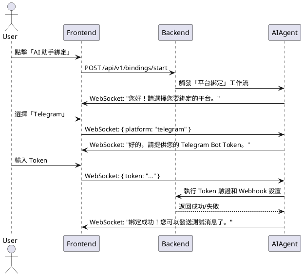

# Morning AI - 終極架構圖與程式碼腳手架

**版本**: 2.0 (終極整合版)
**日期**: 2025-09-12
**作者**: Manus AI

---

## 1. **概述**

本文件提供了 Morning AI 平台的**可視化架構藍圖**和**可執行的程式碼基礎**。它包含了使用 `draw.io` 繪製的詳細架構圖、UML 圖，以及為每個微服務準備的標準化程式碼腳手架和數據庫遷移腳本。這是將抽象設計轉化為具體實現的關鍵橋樑。

## 2. **終極系統架構圖 (Draw.io)**

此架構圖描繪了 Morning AI 系統的全貌，包括用戶、Cloudflare、前端應用、後端微服務、數據庫、AI/ML 設施以及第三方服務之間的交互關係。

**[點擊此處下載 `architecture.drawio` 原始檔](assets/architecture.drawio)**

 *<-- 佔位符：嵌入 `architecture.png` 預覽圖*

### **核心組件詳解**

- **用戶流量**: 用戶通過 `app.morningai.me` 訪問前端，所有流量經過 Cloudflare 進行安全過濾和全球加速。
- **前端 (Vercel)**: Next.js 應用程序處理用戶界面渲染和客戶端邏輯。
- **API 網關**: Cloudflare 作為 API 網關，將 `api.morningai.me` 的請求路由到後端 AWS Fargate 服務。
- **後端微服務 (AWS Fargate)**: 一系列 FastAPI 服務，每個服務都運行在獨立的容器中，並可獨立擴展。
- **數據層 (AWS RDS & ElastiCache)**: PostgreSQL 作為主數據庫，Redis 用於緩存。
- **AI 層 (AWS SageMaker)**: 託管和服務機器學習模型。
- **異步通信 (SQS & EventBridge)**: 服務之間通過消息隊列和事件總線進行解耦通信。
- **數據分析 (Redshift & Glue)**: 數據通過 ETL 管道流入數據倉庫，用於 BI 分析。

## 3. **數據庫實體關係圖 (ERD)**

此 ERD 詳細定義了數據庫中的核心實體及其關係，是數據庫設計的基礎。

**[點擊此處下載 `database_erd.drawio` 原始檔](assets/database_erd.drawio)**

 *<-- 佔位符：嵌入 `database_erd.png` 預覽圖*

### **核心實體**
- `tenants`: 租戶信息。
- `users`: 用戶賬戶。
- `roles`: 角色定義 (admin, manager, user)。
- `user_roles`: 用戶與角色的多對多關係。
- `ai_agents`: AI Agent 的配置和狀態。
- `tasks`: AI Agent 執行的任務。
- `subscriptions`: 用戶訂閱信息。
- `invoices`: 支付發票。

## 4. **AI Agent 工作流 (UML - PlantUML)**

以下是使用 PlantUML 描述的「AI Agent 輔助平台綁定」的時序圖，展示了用戶、前端、後端和 AI Agent 之間的交互流程。

**[點擊此處下載 `ai_binding_flow.puml` 原始檔](assets/ai_binding_flow.puml)**



## 5. **標準化程式碼腳手架 (Repo Skeleton)**

為了統一開發規範、提高效率，我們為每個後端微服務提供了一個標準的 **FastAPI 程式碼腳手架**。這個腳手架集成了日誌、配置、數據庫連接、測試框架等最佳實踐。

**[點擊此處下載 `service_skeleton.zip`](assets/service_skeleton.zip)**

### **腳手架目錄結構**

```
/service-name
├── .github/workflows/      # CI/CD 流程模板 (包含四件組檢核)
├── .vscode/                # VSCode 開發環境配置
├── app/                    # FastAPI 應用代碼
│   ├── __init__.py
│   ├── api/                # API 路由
│   ├── core/               # 配置、日誌、中間件
│   ├── crud/               # 數據庫操作 (Create, Read, Update, Delete)
│   ├── models/             # 數據庫模型 (SQLModel)
│   ├── schemas/            # Pydantic 數據校驗
│   └── main.py             # 應用入口
├── db/                     # Alembic 數據庫遷移腳本
│   └── versions/
├── tests/                  # Pytest 測試代碼
│   ├── __init__.py
│   ├── conftest.py         # 測試夾具
│   └── test_main.py
├── .env.example            # 環境變量示例
├── .gitignore
├── Dockerfile              # 多階段構建 Dockerfile
├── pyproject.toml          # 項目依賴 (Poetry)
└── README.md               # 服務說明文檔
```

### **核心特性**
- **Poetry**: 用於依賴管理和虛擬環境。
- **SQLModel**: 結合了 Pydantic 和 SQLAlchemy 的優點，簡化數據庫模型和 API 數據校驗。
- **Alembic**: 用於數據庫模式的遷移和版本控制。
- **Pytest**: 作為標準的測試框架。
- **Docker**: 提供優化後的多階段構建 Dockerfile，減小鏡像體積。
- **CI/CD 集成**: 內置了符合「四件組」驗收標準的 GitHub Actions workflow 模板。

## 6. **數據庫遷移與種子數據 (Migration & Seeds)**

- **遷移腳本 (`db/versions/*.py`)**: 由 Alembic 自動生成，記錄了數據庫結構的每一次變更，確保不同環境的數據庫結構一致。
- **種子腳本 (`db/seed.py`)**: 一個獨立的 Python 腳本，用於向數據庫中填充初始的基礎數據，如默認角色、管理員賬戶、系統配置等。CI/CD 流程會在數據庫遷移後自動執行此腳本。

**執行命令示例**:
```bash
# 應用所有數據庫遷移
alembic upgrade head

# 填充種子數據
python db/seed.py
```

## 7. **結論**

本文件提供的架構圖和程式碼腳手架是 Morning AI 項目的工程基石。它們將設計藍圖轉化為標準化、可執行、可擴展的代碼結構，確保了開發團隊能夠在此基礎上高效、高質量地進行協作。通過統一的腳手架和自動化的數據庫管理流程，我們能夠顯著降低開發複雜性，並為後續的快速迭代和維護奠定堅實的基礎。

