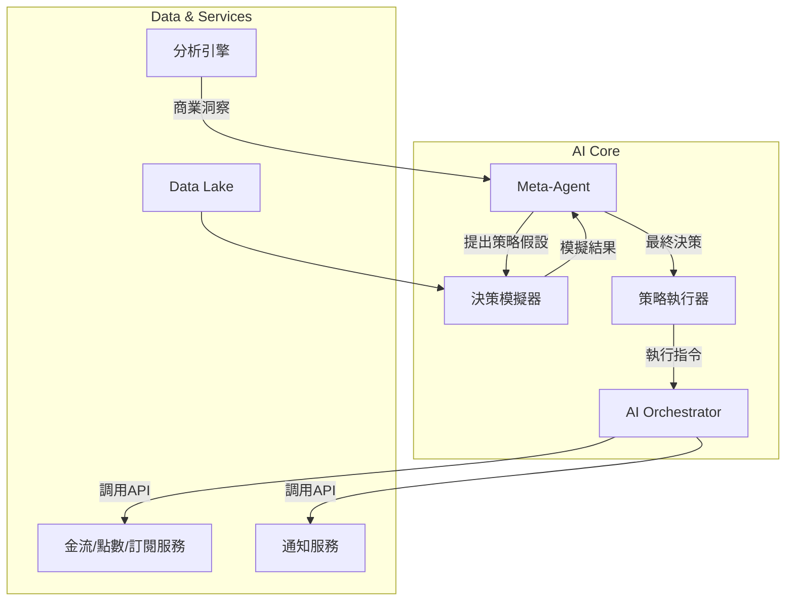

# Morning AI - 智能商業決策引擎升級方案

**版本**: 1.0
**日期**: 2025-09-12

---

## 1. 升級願景：從「數據洞察」到「自主決策與執行」

當前的 Meta-Agent 系統已經具備了初步的數據分析和洞察能力，但其決策過程仍需要人工干預和確認。本次升級的核心目標是將 Meta-Agent 從一個**分析師**和**建議者**的角色，徹底轉變為一個能夠**自主制定、模擬、執行並評估**商業策略的**智能決策引擎 (Intelligent Decision Engine, IDE)**。

我們的願景是打造一個能夠 7x24 小時不間斷監控市場動態、用戶行為和內部運營狀況，並自主做出最優商業決策的 AI 大腦，將 Morning AI 的運營效率和智能化水平提升到前所未有的高度。

## 2. 核心架構升級：引入「決策模擬器」與「策略執行器」

為了實現這一願景，我們將在現有的 AI Orchestrator 架構基礎上，引入兩個關鍵組件：

1.  **決策模擬器 (Decision Simulator)**: 一個基於歷史數據和強化學習的沙盒環境，用於在真實執行前，推演不同商業策略可能帶來的影響。
2.  **策略執行器 (Strategy Executor)**: 一個負責將 Meta-Agent 最終確定的策略，轉化為對底層微服務（如金流、點數、通知服務）的具體 API 調用的模組。

### 2.1. 升級後的架構圖



### 2.2. 工作流程詳解

1.  **洞察與假設 (Insight & Hypothesis)**
    - **Meta-Agent** 持續從 **Analytics Engine** 獲取關於用戶行為、市場趨勢、收入指標的深度洞察。
    - **示例**: Meta-Agent 發現「來自 Facebook 廣告的用戶，其 LTV 較高，但 30 天流失率也高於平均水平」。基於此，它提出一個策略假設：「如果我們為這部分用戶在註冊後第 25 天，自動發放一張 8 折的年度訂閱優惠券，是否能有效降低其流失率並提升總 LTV？」

2.  **模擬與評估 (Simulation & Evaluation)**
    - **Meta-Agent** 將此策略假設（包含目標用戶群、觸發條件、具體行動）發送給 **決策模擬器**。
    - **決策模擬器** 利用 **Data Lake** 中的歷史數據，創建一個虛擬的用戶群體，並在這個沙盒中運行該策略 10,000 次。
    - **模擬器** 輸出詳細的預測報告，包括：預計流失率變化、預計 MRR 影響、預計 LTV 變化、以及置信區間。
    - **示例報告**: 「執行此策略後，預計目標用戶群的 30 天流失率將從 15% 降低到 9% (±1.5%)，MRR 在未來 3 個月內預計將提升 5% (±0.8%)。」

3.  **決策與執行 (Decision & Execution)**
    - **Meta-Agent** 根據模擬器的報告，結合預設的業務目標（如：優先提升用戶留存，或優先提升短期收入），做出最終決策。
    - 如果決策為「執行」，**Meta-Agent** 會生成一個標準化的策略指令，發送給 **策略執行器**。
    - **策略執行器** 解析指令，並將其轉化為對 **AI Orchestrator** 的一系列任務調用。
    - **示例指令**: 
      ```json
      {
        "strategy_name": "High_Value_User_Retention_Q4",
        "target_segment": {
          "source": "facebook_ads",
          "registration_days": 25
        },
        "action": {
          "type": "grant_coupon",
          "params": {
            "discount_type": "percentage",
            "value": 20,
            "product_type": "annual_subscription"
          }
        },
        "notification": {
          "channel": "email",
          "template_id": "retention_offer_email_v1"
        }
      }
      ```

4.  **監控與反饋 (Monitoring & Feedback)**
    - 策略執行後，**Meta-Agent** 會持續監控該策略的實際效果，並與模擬器的預測結果進行對比。
    - 這種真實世界的反饋會被用來不斷優化 **決策模擬器** 的模型，形成一個持續學習和進化的閉環。

## 3. 治理主控台的升級

為了管理這個更強大的決策引擎，AI 治理主控台需要增加以下模組：

- **策略管理中心**: 一個可視化界面，用於查看當前所有正在運行的、已完成的、以及在模擬中的 AI 自主策略。運營人員可以在此手動暫停或終止某個策略。
- **模擬器控制台**: 允許運營人員手動發起策略模擬，或調整模擬器的參數（如：風險偏好）。
- **決策日誌與歸因**: 詳細記錄每一次 AI 自主決策的完整過程，包括數據洞察、策略假設、模擬結果和最終決策依據，確保所有決策都是可追溯、可解釋的。

## 4. 實施路線圖

### 階段一：基礎設施搭建 (2週)

- 完成 **決策模擬器** 和 **策略執行器** 的基礎程式碼腳手架。
- 建立從金流服務到 Data Lake 的實時數據管道。
- 定義 Meta-Agent 與新組件之間的標準化 API 接口。

### 階段二：第一個自主策略 MVP (4週)

- 實現「智能挽留」作為第一個端到端的自主決策策略。
- 開發治理主控台的「策略管理中心」V1 版本。
- 進行小範圍 A/B 測試，驗證 AI 決策的實際效果。

### 階段三：擴展與優化 (持續)

- 逐步增加更多的自主決策場景，如動態定價、智能用戶分群、個性化點數獎勵等。
- 不斷用真實數據優化模擬器的預測模型。
- 完善治理主控台的功能，提供更深度的洞察和更精細的控制。

通過這次升級，Morning AI 將真正擁有一個能夠自主思考和行動的商業大腦，從而在激烈的市場競爭中獲得決定性的、可持續的領先優勢。

